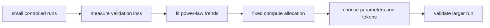
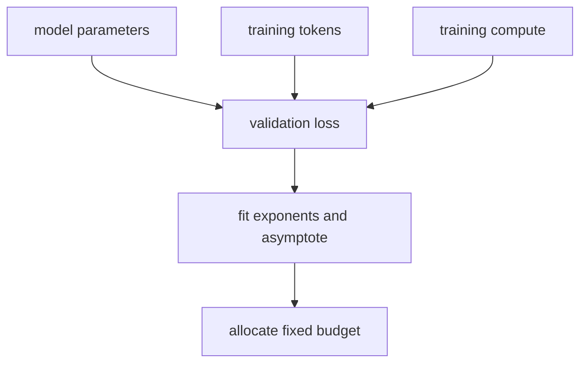
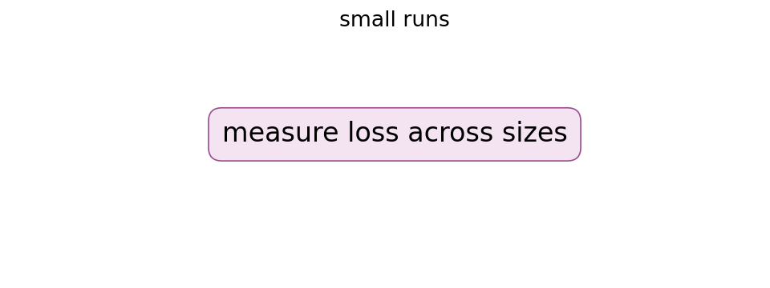
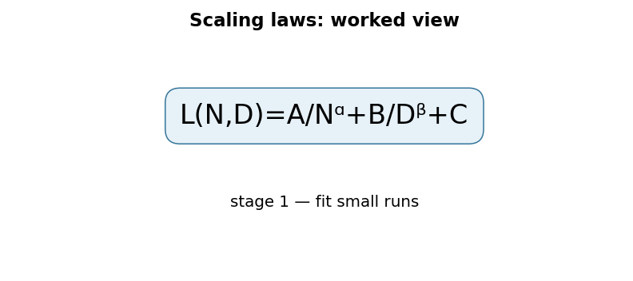

# Scaling Laws for Neural Language Models

## TL;DR

Scaling laws describe empirical power-law trends between language-model loss and
model size, dataset size, and training compute. Kaplan and colleagues found
smooth trends across their experimental range and used them to reason about
budget allocation. Small controlled runs can therefore guide larger experiments.
These fits are planning tools, not guarantees of capability, safety, or product
value.

## Fun Map for First Years 🧭

Scaling laws use small experiments to estimate what larger training runs may do, like testing recipe sizes before cooking for a stadium.

`🧪 small runs → 📉 measure loss → 📈 fit trend → ⚙️ plan compute, model, and data`

Scaling laws use small experiments to estimate what bigger training runs may do. They are planning tools, not promises that more compute automatically creates a better product.

A team can train several smaller models, plot their losses, then estimate whether an expensive larger run is likely to be worthwhile. The curve guides a decision before spending the full budget.

💻 **CS analogy:** it is empirical capacity planning: benchmark several system sizes, fit a trend, then use the curve to decide where the next compute budget should go.

## Math Playground 🧮

The essential equation or rule is:

```text
L(N) ≈ L_∞ + aN^−α
```

**Essential equation:** \(L(N)\approx L_\infty+aN^{-\alpha}\). L is error and N is model size. \(L_\infty\) is the floor the fitted curve approaches; α says how quickly extra parameters help. The negative exponent means diminishing returns: a larger model can improve performance, but each further increase normally buys less. This is a measured fit to experiments, not a universal guarantee.

L is error and N is model size. The negative exponent means diminishing returns: each further increase normally buys less improvement.

L∞ represents the fitted floor, not necessarily an absolute limit of intelligence. α controls how quickly the curve falls; different data, architectures, and metrics can have different values.

## Background: What Came Before 🕰️

Teams knew larger language models often improved, but compute budgets were allocated with scattered rules of thumb: scale parameters, data, or training steps without a shared quantitative guide. That made expensive runs easy to undertrain or mis-size. Scaling-laws studies were needed to turn repeated measurements into forecasts for planning the next training run.

This gave teams a quantitative way to plan expensive runs instead of relying only on scattered rules of thumb.

This made empirical measurement part of model planning, while also warning teams not to extrapolate a smooth curve far beyond the conditions they actually tested.

## Why It Matters

Large language-model training is expensive, so design decisions cannot rely on
one final run. Before scaling laws, it was clear that larger models and more data
often helped, but there was little compact guidance for estimating diminishing
returns. This paper fit validation cross-entropy trends across controlled runs
and used those fits to discuss how parameters, tokens, and compute should grow.

The work shaped later language-model planning. Its compute-optimal conclusions
were later revised by Chinchilla, which this collection covers separately. A law
is conditional on architecture, data mixture, tokenizer, optimizer, metric, and
experimental range. It does not predict benchmark behavior, reliability,
misuse risk, serving cost, or whether an application needs a larger model.

## Core Intuition

Think of small runs as survey points on a hillside. Extra parameters, tokens, or
FLOPs lower loss, but each increment helps less than the one before it. A
log-log plot can look roughly straight, which corresponds to a power law in
ordinary coordinates. Planning asks where the next budget should go: a huge model
with too little data leaves capacity underused, while huge data with a tiny model
leaves modeling capacity limited.



## The Mechanism

The paper uses relationships of the form
\(L(N)\approx L_\infty+aN^{-\alpha}\), with analogous forms for data and
compute. N is model size under a stated counting convention, L-infinity is a
fitted asymptote, and alpha controls diminishing returns. Taking logarithms makes
the power component approximately linear, which helps inspect fits and residuals.





Training compute depends on model size and tokens, so a fixed budget creates an
allocation problem. The paper used empirical fits to recommend jointly scaling
dimensions rather than treating data as free. The GIF is illustrative, not a
paper measurement. Exact exponents and crossover points must be checked against
the source and current workload; they are not constants to paste into a program.

Smooth loss is informative but incomplete. A trend can coexist with discontinuous
benchmark behavior, memorization, bias, instability, or infrastructure limits.
Extrapolation becomes weak beyond observed range, after architecture changes, or
when data quality shifts. A large run is a hypothesis to validate with held-out
measurements, not a result guaranteed by a fitted line.

## Practical Engineering Notes

### Worked Math & Dataflow

The compact view below makes the paper's central calculation concrete:

```text
L(N,D)=A/Nᵅ+B/Dᵝ+C
```

In practice, the calculation is a pipeline: The power-law terms separate error caused by limited model capacity from error caused by limited data. Fits are planning tools: extrapolation must be checked with held-out runs. The important engineering
choice is to preserve the paper's intended invariant while making the operation
fit the available memory, batch size, and evaluation protocol.





Build a scaling study as a controlled experiment. Fix tokenizer, sequence length,
data mixture, preprocessing, optimizer family, learning-rate schedule, and
evaluation protocol while varying intended scale. Record parameter convention,
tokens seen, global batch, gradient accumulation, FLOPs estimate, wall time,
utilization, failures, energy, and cost. Tokens from a changed tokenizer are not
directly comparable to an earlier curve.

Fit multiple seeds and report uncertainty, residuals, and held-out validation
runs. Reserve configurations for extrapolation checks instead of selecting an
exponent after seeing the largest model. Inspect residual curvature and compare
functional forms. A slightly lower loss can still be a worse system if it misses
latency, memory, reliability, data-governance, or operating-cost constraints.

Data quality is as important as quantity. Deduplication, filtering, language
mix, licensing, source diversity, and contamination change effective information
per token. Track data revisions in manifests and measure slice loss as well as
aggregate loss. Keep evaluation data isolated from training and iterative
benchmark selection. Scaling a contaminated pipeline makes a bad curve more
confident, not more useful.

Serving belongs in the budget. More parameters affect checkpoint storage,
optimizer state, communication, accelerator memory, inference latency, KV-cache
capacity, and operations cost. Define kill criteria before a large run, such as
loss divergence, utilization failure, data-quality issue, safety regression, or
spend threshold. A scaling forecast should support disciplined decisions, not
rationalize irreversible expense.

### Experimental design and operational review

Run a pilot ladder rather than a single arbitrary small model. Select several
sizes spanning enough range to identify curvature, allocate comparable training
quality to each, and include a configuration that is held out from curve fitting.
If the held-out result misses the forecast materially, investigate before
committing a larger budget. Potential causes include optimizer instability,
insufficient training duration, data-pipeline bugs, tokenizer changes, hardware
throughput bottlenecks, or simply a functional form that does not hold in that
range. The correct response is new evidence, not silently adjusting a chart.

Compute accounting must be explicit. Theoretical FLOPs and billed accelerator
time differ when utilization, communication, checkpointing, retries, data
loading, evaluation, and failures are included. Track both. A training plan that
fits a nominal FLOP budget can still exceed a product budget because it requires
an impractical cluster configuration or leaves expensive accelerators idle.
Include availability, queue time, storage, networking, and inference capacity in
the decision record when they are material constraints.

Quality gates should be independent of the loss curve. Evaluate data licensing,
privacy exposure, contamination, harmful output behavior, reliability under
long contexts, calibration, and downstream task slices at each scale. Larger
models can change the severity of a failure even if validation loss improves
smoothly. Establish stop conditions and responsible owners before a run starts,
so operational or governance findings are not treated as unexpected obstacles to
a predetermined scale target.

Use model-size and token-count conventions consistently. Parameter totals may
include or exclude embeddings, tied output weights, adapters, or sparse experts;
token totals may count repeated epochs, filtered examples, or padding
differently. A scaling table without definitions is easy to misread. Store the
script that produces each accounting figure and test it against checkpoint and
dataset manifests. This lets later teams update a curve without rewriting its
history.

Forecasts should describe uncertainty in language people can act on. State the
observed range, fit error, expected loss interval, assumptions, unmeasured
risks, and validation step. Avoid decimal precision that exceeds experimental
noise. A planning review should be able to ask whether an expected loss decrease
is worth incremental cost, schedule, carbon, and risk, and to choose a smaller
or delayed experiment when evidence is weak.

Finally, retain all intermediate checkpoints and measurements long enough to
audit anomalies and reproduce a key allocation decision. A later revision may
need to explain why a projected gain failed or why a data change shifted the
curve. These artifacts turn empirical scaling from a one-off plot into a
maintainable engineering practice.

Scaling evidence also supports communication across research, infrastructure,
finance, and product teams. Each group needs a different view of the same run:
loss trend, accelerator demand, dollar cost, launch schedule, or user-facing
benefit. A shared documented forecast prevents an engineering estimate from
being mistaken for a promise. It makes tradeoffs explicit and allows a smaller
experiment to be chosen when expected value is uncertain.

This discipline is especially valuable when external conditions change. New
hardware, a data-source outage, a legal restriction, or a revised evaluation
suite can invalidate assumptions without making prior measurements worthless.
Update the model with new controlled points, preserve earlier versions, and
state which decisions were made under which evidence. Good scaling work is an
iterative measurement process, not a single extrapolation ceremony.

## Runnable Code Example

### Run it

The implementation is intentionally small and self-checking. From the repository root, use Python 3; the module docstring states the learning goal, comments identify the paper-specific calculation, and assertions verify the toy invariant.

```bash
python3 papers/30-scaling-laws/code/power_law.py
```

### Read it in order

Start with the module docstring, then follow the named helper calculations and the final assertions. The example is a dependency-light teaching implementation, not a production training system; change one input at a time and rerun it to see which invariant changes.


[`code/power_law.py`](code/power_law.py) evaluates a toy negative-exponent power
law and checks that doubling compute lowers a positive loss proxy.

```bash
python3 papers/30-scaling-laws/code/power_law.py
```

It demonstrates diminishing returns, not a fit to a real language model.

## Common Misconceptions & Pitfalls

**“Power-law improvement is exponential.”** Negative powers yield diminishing
returns as the scale variable grows.

**“Loss predicts all capabilities.”** Loss is valuable but does not fully decide
task behavior, safety, or product utility.

**“More parameters are always compute-optimal.”** A fixed budget also constrains
tokens and training steps.

## Interview Q&A

**Q:** Why use log axes?
**A:** A power component becomes approximately linear, exposing trends and
residuals.

**Q:** What is an irreducible loss term?
**A:** A fitted asymptote within stated model, data, and metric assumptions.

**Q:** Why validate extrapolation?
**A:** Fits can fail beyond measured range or after data and architecture shifts.

**Q:** What is compute-optimal training?
**A:** Choosing size and tokens to minimize expected loss under a fixed budget.

**Q:** Does lower loss justify deployment?
**A:** No. Cost, reliability, safety, governance, and task metrics also matter.

## Implementation Walkthrough

Scaling-law fits relate validation loss to model size, data, or compute over a
measured range. Fit in log space, preserve uncertainty and held-out points,
then treat extrapolation as a planning estimate rather than a guarantee. Data
quality, architecture, and optimizer changes can shift the curve, so do not
mix incompatible runs into one tidy-looking power law.

## SDE2 Interview Drill-down

These prompts are designed for a second-level software engineering interview: explain the mechanism, name the operational trade-off, and describe how you would test it.

**Q:** Walk through empirical loss scaling end to end. What does `L(N,D)=A/Nᵅ+B/Dᵝ+C` mean in an implementation?
**A:** Start by identifying the data structure entering the operation, the learned or configured values it uses, and the invariant that must hold at the output. In this paper, L(N,D)=A/Nᵅ+B/Dᵝ+C is not just notation: it tells you what is compared, normalized, accumulated, or optimized. A strong implementation makes those stages visible in separate functions, keeps tensor shapes and dtypes explicit, and tests a tiny hand-computed example before optimizing. Explain what happens when the inputs are short, padded, empty, or unusually large; those cases often reveal whether the code actually matches the paper.

**Follow-up:** Which invariant would you assert?
**A:** Assert the property that makes the method meaningful: probabilities normalize over valid choices, a residual preserves shape, a target does not bootstrap past termination, or an update leaves frozen state untouched. The assertion should be local and cheap enough to run in tests, not an end-to-end hope such as “accuracy improves.” Also compare the optimized path with a simple reference on random small inputs using an appropriate tolerance. That catches indexing, masking, reduction, and broadcasting errors while the failing example is still understandable.

**Q:** What is the main production trade-off, and how would you capacity-plan it?
**A:** The practical trade-off here is small pilot runs reduce planning uncertainty, but extrapolation is sensitive to data quality and regime changes. Estimate both arithmetic work and memory movement, then identify whether the service is compute-bound, bandwidth-bound, latency-bound, or limited by coordination. Include batch-size effects, peak activation/state memory, serialization, and cold-start behavior; average throughput can hide a bad tail latency. Choose a baseline configuration, measure it on representative shapes, and document which quality metric is allowed to move. If the system is distributed, include communication and retry behavior rather than treating the model operation as an isolated kernel.

**Follow-up:** What would make you reject an apparently faster optimization?
**A:** Reject it when it changes the evaluation contract, weakens isolation, creates silent quality regressions, or only wins on a synthetic shape. For this paper, watch especially for fitting correlated measurements or treating loss as downstream quality. A safe rollout uses a reference implementation, shadow traffic or canaries, resource limits, and dashboards for both system and model metrics. Keep the old path available until numerical outputs, error rates, p95/p99 latency, and cost are stable across the important input distributions.

**Q:** How would you debug a model that passes unit tests but fails in production?
**A:** Reproduce the smallest production-shaped input and compare intermediate values against the reference path, not only the final score. Log versioned preprocessing, shapes, masks, random seeds where relevant, and the exact model/configuration identifiers; otherwise a numerical symptom can be caused by data drift or a serving mismatch. Separate failures into data, numerical stability, optimization, and infrastructure categories. For this method, begin with use held-out scales, confidence intervals, and task-level validation, then run a controlled ablation that disables the paper-specific mechanism to determine whether the regression is in the mechanism or its integration.

**Follow-up:** What evidence would you present in the postmortem or interview?
**A:** Show one minimal failing example, the expected invariant, the observed intermediate divergence, and the fix’s regression test. Add a before/after metric table covering quality, memory, throughput, and tail latency, plus the rollout guard that would catch recurrence. This demonstrates engineering judgment: the goal is not merely to identify a clever algorithm, but to make its behavior observable, reproducible, and safe to operate.


## Further Reading

- [Original paper](https://arxiv.org/abs/2001.08361)
- [Chinchilla](https://arxiv.org/abs/2203.15556)
- [OpenAI scaling laws](https://openai.com/index/scaling-laws-for-neural-language-models/)
