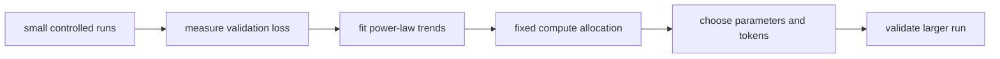
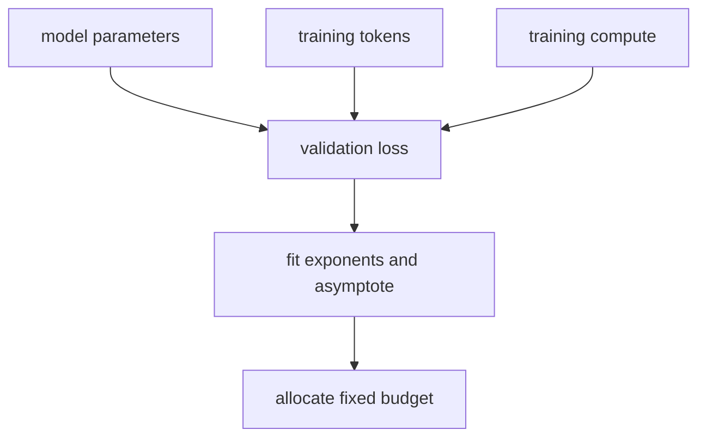

# Scaling Laws for Neural Language Models

## 1. TL;DR
Scaling laws describe empirical power-law trends between language-model loss and
model size, dataset size, and training compute. Kaplan and colleagues found
smooth trends across their experimental range and used them to reason about
budget allocation. Small controlled runs can therefore guide larger experiments.
These fits are planning tools, not guarantees of capability, safety, or product
value.

## 2. Fun Map for First Years
Scaling laws use small experiments to estimate what larger training runs may do, like testing recipe sizes before cooking for a stadium.

`🧪 small runs → 📉 measure loss → 📈 fit trend → ⚙️ plan compute, model, and data`

Scaling laws use small experiments to estimate what bigger training runs may do. They are planning tools, not promises that more compute automatically creates a better product.

A team can train several smaller models, plot their losses, then estimate whether an expensive larger run is likely to be worthwhile. The curve guides a decision before spending the full budget.

💻 **CS analogy:** it is empirical capacity planning: benchmark several system sizes, fit a trend, then use the curve to decide where the next compute budget should go.

### Beginner walkthrough

Read the arrows as a sequence of responsibilities. First identify what enters
the system, then ask what the paper changes, what information is preserved or
discarded, and what leaves the operation. For **empirical loss fitting across model and data scales**, the key question
is not “does the model sound clever?” but “which intermediate value carries the
new information, and what would go wrong if it were missing?”

### CS student checkpoint

The map corresponds to a small program: input data enters a function, the
paper-specific state or transformation runs, and an assertion checks **training budgets, token quality, optimizer settings, and evaluation splits are comparable across runs**.
The equation `L(N,D)=A/Nᵅ+B/Dᵝ+C` is the compact specification for that function. Trace
one concrete item through each arrow before thinking about larger batches,
parallel hardware, or production optimizations.

## 3. Math Playground
The essential equation or rule is:

```text
L(N) ≈ L_∞ + aN^−α
```

**Essential equation:** \(L(N)\approx L_\infty+aN^{-\alpha}\). L is error and N is model size. \(L_\infty\) is the floor the fitted curve approaches; α says how quickly extra parameters help. The negative exponent means diminishing returns: a larger model can improve performance, but each further increase normally buys less. This is a measured fit to experiments, not a universal guarantee.

L is error and N is model size. The negative exponent means diminishing returns: each further increase normally buys less improvement.

L∞ represents the fitted floor, not necessarily an absolute limit of intelligence. α controls how quickly the curve falls; different data, architectures, and metrics can have different values.

## 4. Background: What Came Before
Teams knew larger language models often improved, but compute budgets were allocated with scattered rules of thumb: scale parameters, data, or training steps without a shared quantitative guide. That made expensive runs easy to undertrain or mis-size. Scaling-laws studies were needed to turn repeated measurements into forecasts for planning the next training run.

This gave teams a quantitative way to plan expensive runs instead of relying only on scattered rules of thumb.

This made empirical measurement part of model planning, while also warning teams not to extrapolate a smooth curve far beyond the conditions they actually tested.

## 5. Why It Matters
Large language-model training is expensive, so design decisions cannot rely on
one final run. Before scaling laws, it was clear that larger models and more data
often helped, but there was little compact guidance for estimating diminishing
returns. This paper fit validation cross-entropy trends across controlled runs
and used those fits to discuss how parameters, tokens, and compute should grow.

The work shaped later language-model planning. Its compute-optimal conclusions
were later revised by Chinchilla, which this collection covers separately. A law
is conditional on architecture, data mixture, tokenizer, optimizer, metric, and
experimental range. It does not predict benchmark behavior, reliability,
misuse risk, serving cost, or whether an application needs a larger model.

## 6. Core Intuition
Think of small runs as survey points on a hillside. Extra parameters, tokens, or
FLOPs lower loss, but each increment helps less than the one before it. A
log-log plot can look roughly straight, which corresponds to a power law in
ordinary coordinates. Planning asks where the next budget should go: a huge model
with too little data leaves capacity underused, while huge data with a tiny model
leaves modeling capacity limited.



## 7. The Mechanism
The paper uses relationships of the form
\(L(N)\approx L_\infty+aN^{-\alpha}\), with analogous forms for data and
compute. N is model size under a stated counting convention, L-infinity is a
fitted asymptote, and alpha controls diminishing returns. Taking logarithms makes
the power component approximately linear, which helps inspect fits and residuals.




Training compute depends on model size and tokens, so a fixed budget creates an
allocation problem. The paper used empirical fits to recommend jointly scaling
dimensions rather than treating data as free. The GIF is illustrative, not a
paper measurement. Exact exponents and crossover points must be checked against
the source and current workload; they are not constants to paste into a program.

Smooth loss is informative but incomplete. A trend can coexist with discontinuous
benchmark behavior, memorization, bias, instability, or infrastructure limits.
Extrapolation becomes weak beyond observed range, after architecture changes, or
when data quality shifts. A large run is a hypothesis to validate with held-out
measurements, not a result guaranteed by a fitted line.

### Mechanism in Code

At implementation level, the mechanism operates on runs with measured N, D, compute, and validation loss. A faithful
forward pass should follow this order: fit a scaling form, inspect residuals, choose a candidate budget, and test it. Keep the intermediate
representation available while debugging; collapsing everything into one
opaque framework call makes shape and numerical errors much harder to isolate.

The key production failure to guard against is extrapolating across an architecture or data-quality regime change. Add a tiny
reference test with hand-checkable values, then add a property test that
covers padding, empty/short inputs, boundary probabilities, and the largest
supported shape. Compare intermediate tensors with tolerances appropriate to
the dtype, and log the paper-specific statistic during a canary rollout.


## 8. Practical Engineering Notes
### Worked Math & Dataflow

The compact view below makes the paper's central calculation concrete:

```text
L(N,D)=A/Nᵅ+B/Dᵝ+C
```

In practice, the calculation is a pipeline: The power-law terms separate error caused by limited model capacity from error caused by limited data. Fits are planning tools: extrapolation must be checked with held-out runs. The important engineering
choice is to preserve the paper's intended invariant while making the operation
fit the available memory, batch size, and evaluation protocol.


Build a scaling study as a controlled experiment. Fix tokenizer, sequence length,
data mixture, preprocessing, optimizer family, learning-rate schedule, and
evaluation protocol while varying intended scale. Record parameter convention,
tokens seen, global batch, gradient accumulation, FLOPs estimate, wall time,
utilization, failures, energy, and cost. Tokens from a changed tokenizer are not
directly comparable to an earlier curve.

Fit multiple seeds and report uncertainty, residuals, and held-out validation
runs. Reserve configurations for extrapolation checks instead of selecting an
exponent after seeing the largest model. Inspect residual curvature and compare
functional forms. A slightly lower loss can still be a worse system if it misses
latency, memory, reliability, data-governance, or operating-cost constraints.

Data quality is as important as quantity. Deduplication, filtering, language
mix, licensing, source diversity, and contamination change effective information
per token. Track data revisions in manifests and measure slice loss as well as
aggregate loss. Keep evaluation data isolated from training and iterative
benchmark selection. Scaling a contaminated pipeline makes a bad curve more
confident, not more useful.

Serving belongs in the budget. More parameters affect checkpoint storage,
optimizer state, communication, accelerator memory, inference latency, KV-cache
capacity, and operations cost. Define kill criteria before a large run, such as
loss divergence, utilization failure, data-quality issue, safety regression, or
spend threshold. A scaling forecast should support disciplined decisions, not
rationalize irreversible expense.

### Experimental design and operational review

Run a pilot ladder rather than a single arbitrary small model. Select several
sizes spanning enough range to identify curvature, allocate comparable training
quality to each, and include a configuration that is held out from curve fitting.
If the held-out result misses the forecast materially, investigate before
committing a larger budget. Potential causes include optimizer instability,
insufficient training duration, data-pipeline bugs, tokenizer changes, hardware
throughput bottlenecks, or simply a functional form that does not hold in that
range. The correct response is new evidence, not silently adjusting a chart.

Compute accounting must be explicit. Theoretical FLOPs and billed accelerator
time differ when utilization, communication, checkpointing, retries, data
loading, evaluation, and failures are included. Track both. A training plan that
fits a nominal FLOP budget can still exceed a product budget because it requires
an impractical cluster configuration or leaves expensive accelerators idle.
Include availability, queue time, storage, networking, and inference capacity in
the decision record when they are material constraints.

Quality gates should be independent of the loss curve. Evaluate data licensing,
privacy exposure, contamination, harmful output behavior, reliability under
long contexts, calibration, and downstream task slices at each scale. Larger
models can change the severity of a failure even if validation loss improves
smoothly. Establish stop conditions and responsible owners before a run starts,
so operational or governance findings are not treated as unexpected obstacles to
a predetermined scale target.

Use model-size and token-count conventions consistently. Parameter totals may
include or exclude embeddings, tied output weights, adapters, or sparse experts;
token totals may count repeated epochs, filtered examples, or padding
differently. A scaling table without definitions is easy to misread. Store the
script that produces each accounting figure and test it against checkpoint and
dataset manifests. This lets later teams update a curve without rewriting its
history.

Forecasts should describe uncertainty in language people can act on. State the
observed range, fit error, expected loss interval, assumptions, unmeasured
risks, and validation step. Avoid decimal precision that exceeds experimental
noise. A planning review should be able to ask whether an expected loss decrease
is worth incremental cost, schedule, carbon, and risk, and to choose a smaller
or delayed experiment when evidence is weak.

Finally, retain all intermediate checkpoints and measurements long enough to
audit anomalies and reproduce a key allocation decision. A later revision may
need to explain why a projected gain failed or why a data change shifted the
curve. These artifacts turn empirical scaling from a one-off plot into a
maintainable engineering practice.

Scaling evidence also supports communication across research, infrastructure,
finance, and product teams. Each group needs a different view of the same run:
loss trend, accelerator demand, dollar cost, launch schedule, or user-facing
benefit. A shared documented forecast prevents an engineering estimate from
being mistaken for a promise. It makes tradeoffs explicit and allows a smaller
experiment to be chosen when expected value is uncertain.

This discipline is especially valuable when external conditions change. New
hardware, a data-source outage, a legal restriction, or a revised evaluation
suite can invalidate assumptions without making prior measurements worthless.
Update the model with new controlled points, preserve earlier versions, and
state which decisions were made under which evidence. Good scaling work is an
iterative measurement process, not a single extrapolation ceremony.

## 9. Runnable Code Example
### Run from the repository root

Prerequisites: Python 3 and the dependencies imported by [`implementations/30-scaling-laws/code/power_law.py`](implementations/30-scaling-laws/code/power_law.py).
The example is intentionally small enough to run on CPU; it is a teaching
implementation, not a production training or serving benchmark.

```bash
python3 implementations/30-scaling-laws/code/power_law.py
```

### What the example demonstrates

Read the module docstring first, then follow the functions implementing
**empirical loss fitting across model and data scales**. The program turns `L(N,D)=A/Nᵅ+B/Dᵝ+C` into executable operations,
prints a compact result, and checks that **training budgets, token quality, optimizer settings, and evaluation splits are comparable across runs**. The assertion matters:
it tests the semantic contract near the mechanism instead of treating a
plausible final number as proof that the implementation is correct.

### Expected behavior and useful experiments

The command should finish without a traceback and print a successful summary
or assertion message. You should observe the paper-specific behavior, not a
particular random numeric value. Change one input at a time: inspect the
intermediate tensor or state, rerun with a boundary case, and then compare the
result with the expected invariant. A useful first experiment is to **fit held-out scales with confidence intervals and validate against task-level metrics**.

### Production connection

The toy program does not model every distributed or large-scale concern. In a
real service, version the preprocessing and configuration, record the relevant
intermediate statistic, and measure peak memory, throughput, p95/p99 latency,
and task quality. The first production guard should target **regime change or overconfident extrapolation from noisy pilot data**;
preserve a transparent reference path or a canary comparison before replacing
it with a fused, distributed, or highly optimized implementation.

## 10. Common Misconceptions & Pitfalls
- **Misconception: `L(N,D)=A/Nᵅ+B/Dᵝ+C` is the whole implementation.** The equation describes the paper's central relationship, but `empirical loss fitting across model and data scales` also requires explicit input contracts, ordering, masking or sampling rules, and numerical choices. If those details are left implicit, two implementations can share the same formula and still produce different results. Treat the equation as a contract and document each intermediate tensor or state transition.
- **Misconception: the mechanism is automatically reliable when the final metric looks good.** A model can compensate for a wrong reduction, stale state, or malformed edge/token boundary on common examples. The local guard is **training budgets, token quality, optimizer settings, and evaluation splits are comparable across runs**. Check it on a tiny hand-worked fixture and on adversarial inputs before trusting an aggregate benchmark.
- **Pitfall: optimizing the operation before measuring its actual bottleneck.** For this paper, watch for **regime change or overconfident extrapolation from noisy pilot data** rather than assuming the largest theoretical term dominates every workload. Record memory, bandwidth, batch shape, tail latency, and quality slices. An optimization is only safe when it preserves the paper-specific contract and has a rollback path.
- **Pitfall: debugging only the final prediction.** Start with **fit held-out scales with confidence intervals and validate against task-level metrics**; compare intermediate values with a simple reference. Freeze preprocessing, configuration, seeds, and model versions; then bisect the first divergence. This makes a failure reproducible and distinguishes data-contract errors from numerical instability, integration bugs, and a genuinely unsuitable paper mechanism.

## 11. Quick Concept Checks
**Q:** What is the central idea behind **empirical loss fitting across model and data scales**?
**A:** It is a structured data or optimization path, not a slogan: inputs are transformed, paper-specific relationships are computed, invalid choices are excluded when necessary, and the result is aggregated into an output or objective. The important implementation question is which intermediate values must remain observable so a reviewer can connect the code to the paper.

**Q:** How should I read `L(N,D)=A/Nᵅ+B/Dᵝ+C`?
**A:** Read each symbol as an operation with a shape, a data source, and a numerical range. Ask what changes when its scale, temperature, rank, timestep, neighborhood, or other paper-specific value changes. Then make a two- or three-example fixture where the expected result can be calculated by hand; this catches notation-to-code misunderstandings early.

**Q:** What invariant must a correct implementation preserve?
**A:** It must preserve **training budgets, token quality, optimizer settings, and evaluation splits are comparable across runs**. This is stronger than asking whether accuracy improved because it is local, deterministic, and testable near the operation that could be wrong. Assert it at the boundary, compare against a small reference implementation, and include the unusual input shape most likely to violate it in production.

**Q:** What is the most dangerous failure mode?
**A:** The first risk to investigate is **regime change or overconfident extrapolation from noisy pilot data**. It can produce plausible outputs while degrading only a slice of traffic, so monitor a paper-specific statistic alongside quality and system metrics. A canary should compare the old and new paths on identical inputs and should retain enough intermediate diagnostics to explain a regression.

**Q:** How would I test this idea beyond a happy-path unit test?
**A:** Begin with **fit held-out scales with confidence intervals and validate against task-level metrics**, then add differential tests against a transparent reference on small randomized inputs. Cover boundaries such as padding, termination, empty neighborhoods, long sequences, rare tokens, extreme values, or duplicated examples when they apply. Test both output values and gradients or state updates when training behavior is part of the paper's claim.

**Q:** What should I remember when applying the paper in a real system?
**A:** Keep the paper's assumptions in the production contract: version the preprocessing and configuration, expose the relevant intermediate statistic, and define quality slices before tuning performance. Compare throughput, peak memory, p95/p99 latency, and task quality against a baseline. The paper is useful only when its mechanism remains correct under the workload and failure modes you actually operate.

## 12. Interview Q&A
**Q:** Walk through **empirical loss fitting across model and data scales** end to end. How would you implement `L(N,D)=A/Nᵅ+B/Dᵝ+C`?
**A:** Decompose the expression into the actual data path: inputs enter the paper-specific transformation, intermediate scores or states are computed, invalid elements are excluded, and the result is reduced into the output or loss. For this paper, `L(N,D)=A/Nᵅ+B/Dᵝ+C` is an executable contract, not decoration: document tensor shapes, ownership of mutable state, numerical precision, and where batching changes semantics. Keep a small reference implementation beside the optimized path so a reviewer can connect each line of `code` to one term in the equation.

**Follow-up:** What invariant would you assert, and why is it stronger than checking final accuracy?
**A:** Assert that **training budgets, token quality, optimizer settings, and evaluation splits are comparable across runs**. That property is local enough to fail near the defect, whereas accuracy can remain acceptable while a mask, reduction, or state boundary is wrong on a rare input. Add a hand-computed fixture, a randomized differential test against the reference, and shape/dtype assertions at the API boundary. The test should also cover an empty, padded, terminal, high-degree, long-context, or otherwise adversarial case when that input is meaningful for this mechanism.

**Q:** What is the main production trade-off in this paper, and how would you capacity-plan it?
**A:** The central trade-off is that **the mechanism changes both quality behavior and resource use**. Capacity planning therefore needs more than average FLOPs: measure peak memory, memory bandwidth, communication, preprocessing, batch-size sensitivity, and p95/p99 latency on representative distributions. Define a quality budget before optimizing, then compare a simple baseline with the paper mechanism using identical inputs and seeds. A faster path that silently changes tokenization, routing, masking, sampling, or optimization behavior is not an acceptable optimization until its quality impact is measured.

**Follow-up:** Which failure mode would make you roll back first?
**A:** Roll back on evidence of **regime change or overconfident extrapolation from noisy pilot data**, especially when the symptom is silent and outputs still look plausible. Add dashboards for the paper-specific statistic, error and timeout rates, resource saturation, and a task metric sliced by difficult inputs. Use a canary or shadow comparison with the previous implementation, retain the old path behind a flag, and make the rollback decision threshold explicit before deployment. The important SDE2 judgment is to protect the paper’s semantic contract, not merely to chase a faster benchmark.

**Q:** A model passes unit tests but fails in production. What is your debugging plan?
**A:** Start with **fit held-out scales with confidence intervals and validate against task-level metrics**. Reproduce the smallest production-shaped example, freeze the model and preprocessing versions, and compare intermediate tensors or records rather than only the final prediction. Check data contracts, masks, sequence boundaries, random seeds, numerical precision, and serving mode in that order; then bisect between the reference and optimized implementations. If the defect is not numerical, run a controlled ablation that removes the paper-specific mechanism and compare the resulting failure rate, which separates integration problems from a bad mechanism or configuration.

**Follow-up:** What evidence would you present in the review or postmortem?
**A:** Present one minimal failing input, the expected **training budgets, token quality, optimizer settings, and evaluation splits are comparable across runs**, the first intermediate value that diverged, and the regression test that now protects it. Include a before/after table for task quality, memory, throughput, p95/p99 latency, and cost, with slices for the failure population. A complete SDE2 answer also states the rollout guard, owner, and alert threshold. That turns a paper idea into an operable system rather than a one-line claim about an equation.

## 13. Further Reading
- [Original paper](https://arxiv.org/abs/2001.08361)
- [Chinchilla](https://arxiv.org/abs/2203.15556)
- [OpenAI scaling laws](https://openai.com/index/scaling-laws-for-neural-language-models/)
