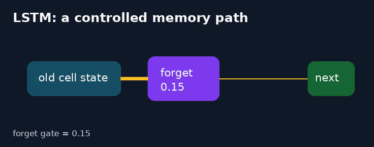
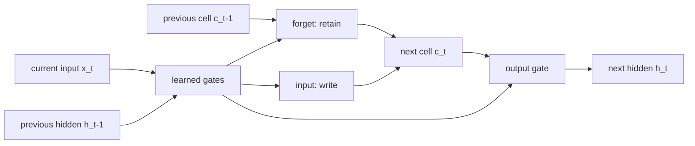
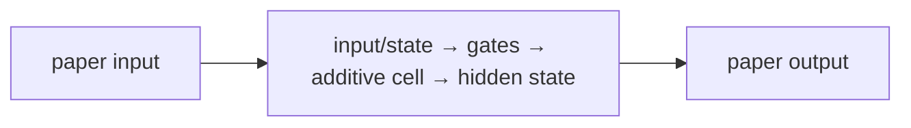
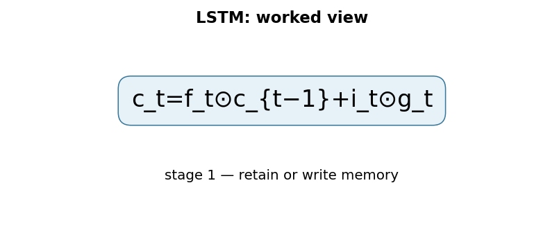

# Long Short-Term Memory

**Hochreiter & Schmidhuber, 1997** · [Original paper](https://doi.org/10.1162/neco.1997.9.8.1735)

## TL;DR

LSTM is a recurrent neural-network design for preserving useful information
across long sequences. Learned gates control what memory is kept, written, and
exposed, creating a more stable training path than a basic recurrent network.

## Fun Map for First Years 🧭

old memory 🧠 → forget gate 🚪 → new evidence ✍️ → cell state 📦 → output 📤

Think of the cell state as a notebook. Gates decide whether an old note is
obsolete and whether a new fact deserves space. For a long sentence, a useful
subject can stay in the notebook despite many unrelated words.

💻 **CS analogy:** The cell state is durable application state; gates are
conditional writes and reads rather than an unconditional variable overwrite.

## Math Playground 🧮

The essential recurrence is c_t = f_t * c_(t-1) + i_t * g_t, followed by
h_t = o_t * tanh(c_t).

```text
c_t = f_t ⊙ c_(t-1) + i_t ⊙ g_t
h_t = o_t ⊙ tanh(c_t)
```

The cell state c_t carries memory. Forget, input, and output gates are values
between zero and one, so they work like dimmer switches for old memory, new
content, and exposed output.

If the forget gate is near one, old memory travels nearly unchanged through
time. That direct route also makes it easier for useful training signals to
travel backward.

## Background: What Came Before 🕰️

Basic recurrent networks repeatedly transform one hidden state. Training over
many time steps multiplies many derivatives, which can vanish or explode.

LSTM introduced controlled additive memory so a model can retain a fact until
it becomes relevant. This was crucial for sequence learning before later
encoder-decoder and attention systems.

## Why It Matters

LSTM made long-distance sequence dependencies practical in language, speech,
handwriting, and time-series tasks. For example, a language model can preserve
the fact that a quotation is still open while processing many ordinary words.
It is the recurrent foundation for the next two papers in this batch: Seq2Seq
uses the LSTM state as an encoder-to-decoder handoff, while Bahdanau attention
later removes the pressure to store every source detail in one state.

## Core Intuition

Input goes through gates that selectively retain old memory and add new
content. The visible hidden state is a gated view of this longer-lived state.
If the model is tracking whether a list has started, the forget gate can keep
that flag alive across irrelevant tokens and the input gate can update it when
a delimiter appears. This is selective state, not a magical unlimited memory.

## The Mechanism

Gates are computed from current input and previous hidden state. A single
affine projection is commonly split into four chunks: input, forget, output,
and candidate. Candidate content is added to retained memory, while the output
gate decides what the rest of the network sees. The protected additive cell
path is the core constant-error-flow idea: when retention is high, a small
change at a later time can still influence an earlier gate during backprop.





### Mechanism in Code

At implementation level, the mechanism operates on input, hidden state, and cell state. A faithful
forward pass should follow this order: compute four gate chunks, update the cell additively, then expose hidden state. Keep the intermediate
representation available while debugging; collapsing everything into one
opaque framework call makes shape and numerical errors much harder to isolate.

The key production failure to guard against is letting padding or another user’s session update recurrent state. Add a tiny
reference test with hand-checkable values, then add a property test that
covers padding, empty/short inputs, boundary probabilities, and the largest
supported shape. Compare intermediate tensors with tolerances appropriate to
the dtype, and log the paper-specific statistic during a canary rollout.


## Practical Engineering Notes

### Worked Math & Dataflow

The compact view below makes the paper's central calculation concrete:

```text
c_t=f_t⊙c_{t−1}+i_t⊙g_t
```

In practice, the calculation is a pipeline: The additive cell update lets a gate preserve old state instead of rewriting it through a nonlinear transform at every step. The output gate can hide retained memory from downstream layers. The important engineering
choice is to preserve the paper's intended invariant while making the operation
fit the available memory, batch size, and evaluation protocol.






Use PyTorch or Keras LSTM implementations for fused kernels and padding
support. Maintain recurrent state deliberately in streaming services and reset
it at sequence boundaries. Pack or mask padded sequences; a zero embedding is
still an input that can move the state when biases are nonzero. LSTMs use fixed
memory but cannot parallelize time steps like Transformers, so benchmark the
latency benefit of constant-size state against the loss of batching freedom.

## Runnable Code Example

Run python3 implementations/31-long-short-term-memory/code/lstm_cell.py.
The program computes all four gate values, advances a masked seven-step batch,
and checks that a finite gradient reaches the gate parameters. Read
run_sequence first: its length mask demonstrates why padding must not silently
change a shorter sequence's hidden or cell state.

## Common Misconceptions & Pitfalls

- LSTM improves long-range retention; it does not guarantee perfect recall.
- Hidden state is the exposed view of memory, not the cell state itself.

## Interview Q&A

**Q:** Why is LSTM better than a basic RNN for long dependencies?  
**A:** Its gated additive cell state can preserve information and gradients.

**Q:** What does the forget gate do?  
**A:** It scales old cell memory, allowing learned deletion.

**Q:** Why sigmoid gates?  
**A:** They provide smooth values between zero and one.

**Q:** What does the output gate control?  
**A:** Which memory is exposed as the hidden state.

**Q:** Why use Transformers now?  
**A:** Their attention computations parallelize across positions during training.

## Deeper Mechanism and Engineering

At each time step, concatenate the current input with the previous exposed
hidden state. Four learned transformations of that combined vector produce
gate values and candidate content. Three sigmoid gates act as fractions: input
controls writing, forget controls retention, and output controls visibility.
Candidate content is usually passed through tanh so it can add or subtract
evidence from the cell.

The cell update is deliberately additive. Imagine a model storing whether a
quotation has opened. Across ordinary words, it can keep the input gate near
zero and the forget gate near one, carrying that fact forward. A closing quote
can then trigger a new candidate and a write. Hidden state may expose only the
parts needed for the next prediction, while cell state privately preserves
longer-lived context.

Basic RNN training repeatedly multiplies recurrent weights and activation
derivatives. Small shrinkage compounded through many steps can erase a useful
learning signal. An LSTM cell has a direct state-to-state path controlled by
the forget gate. When a task needs retention, a forget value near one leaves
both stored information and its training route almost intact.

This does not guarantee perfect memory. Saturated sigmoids, poor
initialization, insufficient capacity, and bad sequence boundaries still hurt
training. The contribution is a learnable option to preserve a quantity rather
than forcing every fact through a new nonlinear state at every token.

For deployment, choose the output according to the task: use final state for
classification, per-step outputs for forecasting, and autoregressive feedback
for generation. Keep one hidden and cell state per streaming session; reset or
detach it at real boundaries. Reusing state across unrelated requests is both
a correctness and privacy error.

Padding requires care. A padded token must not update the state of a shorter
sequence; use packed sequences or an explicit validity mask. Bidirectional
LSTMs help when a full input is available but cannot serve causal streaming
because the backward direction sees future tokens.

Transformers parallelize training and access arbitrary history positions, so
they dominate many large offline language workloads. LSTMs still offer
constant-size recurrent state and cheap incremental updates. They remain
reasonable for small devices, telemetry, and latency-sensitive streams where
recomputing a full token history is undesirable.

The original paper describes the cell as a way to protect error flow across
long delays. That phrase matters because training is not only about storing an
answer; it is about sending a useful correction back to the moment a gate made
a decision. The forget gate provides a learned shortcut through time. A value
near one says “leave this notebook page mostly unchanged,” while a value near
zero makes room for a replacement.

There are two separate state values in a standard LSTM. The cell state is the
longer-lived notebook, and the hidden state is the message shown to the next
layer or next time step. Keeping them distinct lets a model retain a fact
without always broadcasting it. For example, a language model can remember
that a sentence began with a singular subject while exposing nearby word
features needed to choose the immediate next token.

Gate initialization is a practical detail with a conceptual reason. Many
implementations initialize the forget-gate bias positively, which initially
leans toward retention rather than immediate deletion. It is not a substitute
for data or tuning, but it gives early optimization a plausible memory path.
Clip exploding gradients, monitor sequence-length performance, and compare
against a simple recurrent baseline when diagnosing whether gating is helping.

An LSTM does not automatically know where sequences start or end. In a batch,
padding masks prevent fake tokens from changing state. In a stream, a service
must map each session to its own hidden and cell tensors. This is much like
keeping independent state objects per web request: mixing sessions produces
plausible-looking output that is quietly wrong.

One helpful mental experiment is to unroll the same cell across a sentence.
The parameters are shared, just as one function is called repeatedly in a
loop, but the cell and hidden values change at every iteration. Sharing allows
the model to recognize the same kind of update wherever it occurs. The state
lets its action depend on what has already happened. Increasing hidden width
adds room for more simultaneous features but also raises latency and memory
cost.

For classification, implementations often read an entire sequence and feed a
last relevant hidden state to a classifier. For tagging, every time step emits
a prediction. For generation, the model feeds an output token into the next
step. These are different adapters around the same recurrence. State shape,
sequence direction, and mask policy should be written down before code is
optimized, because they define what information the model is allowed to use.

Finally, compare retention with retrieval. An LSTM is good at carrying a
compact running summary, but it must decide what to preserve before it knows
every future question. Attention later offers a way to revisit stored
positions. The two ideas are complementary in early neural translation:
gating makes sequence processing stable, while attention makes detailed source
information available when the decoder needs it.

## Implementation Walkthrough

The implementation exposes the four packed gate projections and uses a length
mask after each recurrent update. This mirrors real padded batches: zeros are
not harmless once a learned bias is present. Inspect forget-gate averages and
gradient norms across long sequences, but do not mistake a large gate value for
proof that a particular word caused a prediction.

## SDE2 Interview Drill-down

These prompts are designed for a second-level software engineering interview: explain the mechanism, name the operational trade-off, and describe how you would test it.

**Q:** Walk through gated recurrent memory end to end. What does `c_t=f_t⊙c_{t−1}+i_t⊙g_t` mean in an implementation?
**A:** Start by identifying the data structure entering the operation, the learned or configured values it uses, and the invariant that must hold at the output. In this paper, c_t=f_t⊙c_{t−1}+i_t⊙g_t is not just notation: it tells you what is compared, normalized, accumulated, or optimized. A strong implementation makes those stages visible in separate functions, keeps tensor shapes and dtypes explicit, and tests a tiny hand-computed example before optimizing. Explain what happens when the inputs are short, padded, empty, or unusually large; those cases often reveal whether the code actually matches the paper.

**Follow-up:** Which invariant would you assert?
**A:** Assert the property that makes the method meaningful: probabilities normalize over valid choices, a residual preserves shape, a target does not bootstrap past termination, or an update leaves frozen state untouched. The assertion should be local and cheap enough to run in tests, not an end-to-end hope such as “accuracy improves.” Also compare the optimized path with a simple reference on random small inputs using an appropriate tolerance. That catches indexing, masking, reduction, and broadcasting errors while the failing example is still understandable.

**Q:** What is the main production trade-off, and how would you capacity-plan it?
**A:** The practical trade-off here is state is constant-size and streaming-friendly, but time steps remain sequential. Estimate both arithmetic work and memory movement, then identify whether the service is compute-bound, bandwidth-bound, latency-bound, or limited by coordination. Include batch-size effects, peak activation/state memory, serialization, and cold-start behavior; average throughput can hide a bad tail latency. Choose a baseline configuration, measure it on representative shapes, and document which quality metric is allowed to move. If the system is distributed, include communication and retry behavior rather than treating the model operation as an isolated kernel.

**Follow-up:** What would make you reject an apparently faster optimization?
**A:** Reject it when it changes the evaluation contract, weakens isolation, creates silent quality regressions, or only wins on a synthetic shape. For this paper, watch especially for padding changing state, forgotten resets, or exploding recurrent gradients. A safe rollout uses a reference implementation, shadow traffic or canaries, resource limits, and dashboards for both system and model metrics. Keep the old path available until numerical outputs, error rates, p95/p99 latency, and cost are stable across the important input distributions.

**Q:** How would you debug a model that passes unit tests but fails in production?
**A:** Reproduce the smallest production-shaped input and compare intermediate values against the reference path, not only the final score. Log versioned preprocessing, shapes, masks, random seeds where relevant, and the exact model/configuration identifiers; otherwise a numerical symptom can be caused by data drift or a serving mismatch. Separate failures into data, numerical stability, optimization, and infrastructure categories. For this method, begin with mask lengths, isolate sessions, and inspect gate/gradient statistics, then run a controlled ablation that disables the paper-specific mechanism to determine whether the regression is in the mechanism or its integration.

**Follow-up:** What evidence would you present in the postmortem or interview?
**A:** Show one minimal failing example, the expected invariant, the observed intermediate divergence, and the fix’s regression test. Add a before/after metric table covering quality, memory, throughput, and tail latency, plus the rollout guard that would catch recurrence. This demonstrates engineering judgment: the goal is not merely to identify a clever algorithm, but to make its behavior observable, reproducible, and safe to operate.


## Further Reading

- [Original paper](https://doi.org/10.1162/neco.1997.9.8.1735)
- [Sequence to Sequence Learning](https://arxiv.org/abs/1409.3215)
- [Bahdanau attention](https://arxiv.org/abs/1409.0473)
