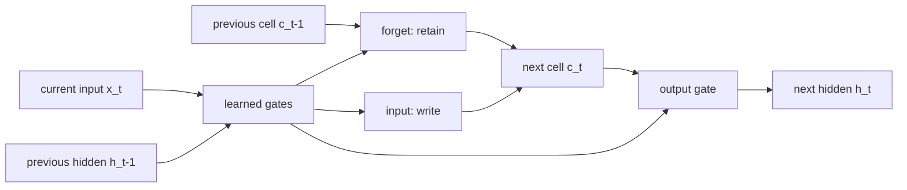
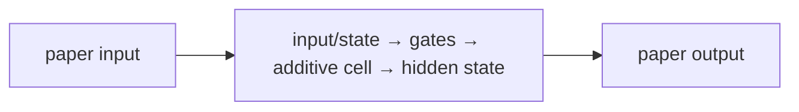

# Long Short-Term Memory

**Hochreiter & Schmidhuber, 1997** · [Original paper](https://doi.org/10.1162/neco.1997.9.8.1735)

## TL;DR

LSTM is a recurrent neural-network design for preserving useful information
across long sequences. Learned gates control what memory is kept, written, and
exposed, creating a more stable training path than a basic recurrent network.

## Fun Map for First Years 🧭

old memory 🧠 → forget gate 🚪 → new evidence ✍️ → cell state 📦 → output 📤

Think of the cell state as a notebook. Gates decide whether an old note is
obsolete and whether a new fact deserves space. For a long sentence, a useful
subject can stay in the notebook despite many unrelated words.

💻 **CS analogy:** The cell state is durable application state; gates are
conditional writes and reads rather than an unconditional variable overwrite.

## Math Playground 🧮

The essential recurrence is c_t = f_t * c_(t-1) + i_t * g_t, followed by
h_t = o_t * tanh(c_t).

```text
c_t = f_t ⊙ c_(t-1) + i_t ⊙ g_t
h_t = o_t ⊙ tanh(c_t)
```

The cell state c_t carries memory. Forget, input, and output gates are values
between zero and one, so they work like dimmer switches for old memory, new
content, and exposed output.

If the forget gate is near one, old memory travels nearly unchanged through
time. That direct route also makes it easier for useful training signals to
travel backward.

## Background: What Came Before 🕰️

Basic recurrent networks repeatedly transform one hidden state. Training over
many time steps multiplies many derivatives, which can vanish or explode.

LSTM introduced controlled additive memory so a model can retain a fact until
it becomes relevant. This was crucial for sequence learning before later
encoder-decoder and attention systems.

## Why It Matters

LSTM made long-distance sequence dependencies practical in language, speech,
handwriting, and time-series tasks. For example, a language model can preserve
the fact that a quotation is still open while processing many ordinary words.
It is the recurrent foundation for the next two papers in this batch: Seq2Seq
uses the LSTM state as an encoder-to-decoder handoff, while Bahdanau attention
later removes the pressure to store every source detail in one state.

## Core Intuition

Input goes through gates that selectively retain old memory and add new
content. The visible hidden state is a gated view of this longer-lived state.
If the model is tracking whether a list has started, the forget gate can keep
that flag alive across irrelevant tokens and the input gate can update it when
a delimiter appears. This is selective state, not a magical unlimited memory.

## The Mechanism

Gates are computed from current input and previous hidden state. A single
affine projection is commonly split into four chunks: input, forget, output,
and candidate. Candidate content is added to retained memory, while the output
gate decides what the rest of the network sees. The protected additive cell
path is the core constant-error-flow idea: when retention is high, a small
change at a later time can still influence an earlier gate during backprop.




### Mechanism in Code

At implementation level, the mechanism operates on input, hidden state, and cell state. A faithful
forward pass should follow this order: compute four gate chunks, update the cell additively, then expose hidden state. Keep the intermediate
representation available while debugging; collapsing everything into one
opaque framework call makes shape and numerical errors much harder to isolate.

The key production failure to guard against is letting padding or another user’s session update recurrent state. Add a tiny
reference test with hand-checkable values, then add a property test that
covers padding, empty/short inputs, boundary probabilities, and the largest
supported shape. Compare intermediate tensors with tolerances appropriate to
the dtype, and log the paper-specific statistic during a canary rollout.


## Practical Engineering Notes

### Worked Math & Dataflow

The compact view below makes the paper's central calculation concrete:

```text
c_t=f_t⊙c_{t−1}+i_t⊙g_t
```

In practice, the calculation is a pipeline: The additive cell update lets a gate preserve old state instead of rewriting it through a nonlinear transform at every step. The output gate can hide retained memory from downstream layers. The important engineering
choice is to preserve the paper's intended invariant while making the operation
fit the available memory, batch size, and evaluation protocol.




Use PyTorch or Keras LSTM implementations for fused kernels and padding
support. Maintain recurrent state deliberately in streaming services and reset
it at sequence boundaries. Pack or mask padded sequences; a zero embedding is
still an input that can move the state when biases are nonzero. LSTMs use fixed
memory but cannot parallelize time steps like Transformers, so benchmark the
latency benefit of constant-size state against the loss of batching freedom.

## Runnable Code Example

Run python3 implementations/31-long-short-term-memory/code/lstm_cell.py.
The program computes all four gate values, advances a masked seven-step batch,
and checks that a finite gradient reaches the gate parameters. Read
run_sequence first: its length mask demonstrates why padding must not silently
change a shorter sequence's hidden or cell state.

## Common Misconceptions & Pitfalls

- **Misconception: `c_t=f_t⊙c_{t−1}+i_t⊙g_t` is the whole implementation.** The equation describes the paper's central relationship, but `LSTM gated recurrent state updates` also requires explicit input contracts, ordering, masking or sampling rules, and numerical choices. If those details are left implicit, two implementations can share the same formula and still produce different results. Treat the equation as a contract and document each intermediate tensor or state transition.
- **Misconception: the mechanism is automatically reliable when the final metric looks good.** A model can compensate for a wrong reduction, stale state, or malformed edge/token boundary on common examples. The local guard is **padding does not update state and forget/input gates remain numerically bounded**. Check it on a tiny hand-worked fixture and on adversarial inputs before trusting an aggregate benchmark.
- **Pitfall: optimizing the operation before measuring its actual bottleneck.** For this paper, watch for **state leakage across sessions, exploding activations, or incorrect sequence masks** rather than assuming the largest theoretical term dominates every workload. Record memory, bandwidth, batch shape, tail latency, and quality slices. An optimization is only safe when it preserves the paper-specific contract and has a rollback path.
- **Pitfall: debugging only the final prediction.** Start with **mask lengths, isolate sessions, and inspect gate and gradient statistics**; compare intermediate values with a simple reference. Freeze preprocessing, configuration, seeds, and model versions; then bisect the first divergence. This makes a failure reproducible and distinguishes data-contract errors from numerical instability, integration bugs, and a genuinely unsuitable paper mechanism.

## Quick Concept Checks

**Q:** What is the central idea behind **LSTM gated recurrent state updates**?
**A:** It is a structured data or optimization path, not a slogan: inputs are transformed, paper-specific relationships are computed, invalid choices are excluded when necessary, and the result is aggregated into an output or objective. The important implementation question is which intermediate values must remain observable so a reviewer can connect the code to the paper.

**Q:** How should I read `c_t=f_t⊙c_{t−1}+i_t⊙g_t`?
**A:** Read each symbol as an operation with a shape, a data source, and a numerical range. Ask what changes when its scale, temperature, rank, timestep, neighborhood, or other paper-specific value changes. Then make a two- or three-example fixture where the expected result can be calculated by hand; this catches notation-to-code misunderstandings early.

**Q:** What invariant must a correct implementation preserve?
**A:** It must preserve **padding does not update state and forget/input gates remain numerically bounded**. This is stronger than asking whether accuracy improved because it is local, deterministic, and testable near the operation that could be wrong. Assert it at the boundary, compare against a small reference implementation, and include the unusual input shape most likely to violate it in production.

**Q:** What is the most dangerous failure mode?
**A:** The first risk to investigate is **state leakage across sessions, exploding activations, or incorrect sequence masks**. It can produce plausible outputs while degrading only a slice of traffic, so monitor a paper-specific statistic alongside quality and system metrics. A canary should compare the old and new paths on identical inputs and should retain enough intermediate diagnostics to explain a regression.

**Q:** How would I test this idea beyond a happy-path unit test?
**A:** Begin with **mask lengths, isolate sessions, and inspect gate and gradient statistics**, then add differential tests against a transparent reference on small randomized inputs. Cover boundaries such as padding, termination, empty neighborhoods, long sequences, rare tokens, extreme values, or duplicated examples when they apply. Test both output values and gradients or state updates when training behavior is part of the paper's claim.

**Q:** What should I remember when applying the paper in a real system?
**A:** Keep the paper's assumptions in the production contract: version the preprocessing and configuration, expose the relevant intermediate statistic, and define quality slices before tuning performance. Compare throughput, peak memory, p95/p99 latency, and task quality against a baseline. The paper is useful only when its mechanism remains correct under the workload and failure modes you actually operate.

## Interview Q&A

**Q:** Walk through **LSTM gated recurrent state updates** end to end. How would you implement `c_t=f_t⊙c_{t−1}+i_t⊙g_t`?
**A:** Decompose the expression into the actual data path: inputs enter the paper-specific transformation, intermediate scores or states are computed, invalid elements are excluded, and the result is reduced into the output or loss. For this paper, `c_t=f_t⊙c_{t−1}+i_t⊙g_t` is an executable contract, not decoration: document tensor shapes, ownership of mutable state, numerical precision, and where batching changes semantics. Keep a small reference implementation beside the optimized path so a reviewer can connect each line of `code` to one term in the equation.

**Follow-up:** What invariant would you assert, and why is it stronger than checking final accuracy?
**A:** Assert that **padding does not update state and forget/input gates remain numerically bounded**. That property is local enough to fail near the defect, whereas accuracy can remain acceptable while a mask, reduction, or state boundary is wrong on a rare input. Add a hand-computed fixture, a randomized differential test against the reference, and shape/dtype assertions at the API boundary. The test should also cover an empty, padded, terminal, high-degree, long-context, or otherwise adversarial case when that input is meaningful for this mechanism.

**Q:** What is the main production trade-off in this paper, and how would you capacity-plan it?
**A:** The central trade-off is that **the mechanism changes both quality behavior and resource use**. Capacity planning therefore needs more than average FLOPs: measure peak memory, memory bandwidth, communication, preprocessing, batch-size sensitivity, and p95/p99 latency on representative distributions. Define a quality budget before optimizing, then compare a simple baseline with the paper mechanism using identical inputs and seeds. A faster path that silently changes tokenization, routing, masking, sampling, or optimization behavior is not an acceptable optimization until its quality impact is measured.

**Follow-up:** Which failure mode would make you roll back first?
**A:** Roll back on evidence of **state leakage across sessions, exploding activations, or incorrect sequence masks**, especially when the symptom is silent and outputs still look plausible. Add dashboards for the paper-specific statistic, error and timeout rates, resource saturation, and a task metric sliced by difficult inputs. Use a canary or shadow comparison with the previous implementation, retain the old path behind a flag, and make the rollback decision threshold explicit before deployment. The important SDE2 judgment is to protect the paper’s semantic contract, not merely to chase a faster benchmark.

**Q:** A model passes unit tests but fails in production. What is your debugging plan?
**A:** Start with **mask lengths, isolate sessions, and inspect gate and gradient statistics**. Reproduce the smallest production-shaped example, freeze the model and preprocessing versions, and compare intermediate tensors or records rather than only the final prediction. Check data contracts, masks, sequence boundaries, random seeds, numerical precision, and serving mode in that order; then bisect between the reference and optimized implementations. If the defect is not numerical, run a controlled ablation that removes the paper-specific mechanism and compare the resulting failure rate, which separates integration problems from a bad mechanism or configuration.

**Follow-up:** What evidence would you present in the review or postmortem?
**A:** Present one minimal failing input, the expected **padding does not update state and forget/input gates remain numerically bounded**, the first intermediate value that diverged, and the regression test that now protects it. Include a before/after table for task quality, memory, throughput, p95/p99 latency, and cost, with slices for the failure population. A complete SDE2 answer also states the rollout guard, owner, and alert threshold. That turns a paper idea into an operable system rather than a one-line claim about an equation.

## Further Reading

- [Original paper](https://doi.org/10.1162/neco.1997.9.8.1735)
- [Sequence to Sequence Learning](https://arxiv.org/abs/1409.3215)
- [Bahdanau attention](https://arxiv.org/abs/1409.0473)
