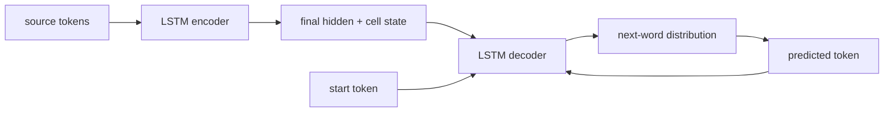

# Sequence to Sequence Learning with Neural Networks

**Sutskever, Vinyals & Le, 2014** · [Original paper](https://arxiv.org/abs/1409.3215)

## TL;DR

Seq2Seq uses one LSTM to read a source sequence and another LSTM to generate
a target sequence. The encoder passes its final state to the decoder, making a
single architecture usable for tasks such as translation. This paper showed
that a deep LSTM encoder-decoder could learn competitive English-to-French
translation end to end.

## Fun Map for First Years 🧭

source words 📥 → encoder memory 🧠 → decoder start state 🚀 → target words 📤

The encoder is like compressing a sentence into a travel summary; the decoder
uses that summary to write the sentence in another language. During training,
the decoder is shown the previous correct target word, a practice technique
called teacher forcing.

💻 **CS analogy:** The encoder returns a serialized request context; the
decoder consumes that context to emit a variable-length response.

## Math Playground 🧮

The key factorization is p(y|x) = product over t of p(y_t | y_before_t, x).

```text
p(y | x) = ∏_t p(y_t | y_1, …, y_(t-1), x)
```

Instead of predicting an entire translation at once, the decoder predicts one
next token conditioned on the source and earlier target tokens. Multiplying
these probabilities rewards a model only when it keeps making compatible
choices through the whole output.

## Background: What Came Before 🕰️

Phrase-based translation assembled outputs from hand-engineered statistical
components. Early neural sequence models also struggled to represent
variable-length input and output in one trainable system.

LSTM memory enabled an encoder to summarize an input and a decoder to emit a
new sequence. Its fixed final vector later revealed a bottleneck, motivating
Bahdanau attention in paper 33.

## Why It Matters

The encoder-decoder pattern became a general recipe for translation,
summarization, speech, and structured generation. It is the direct ancestor of
modern Transformer encoder-decoder systems.

## Core Intuition

The encoder reads until it has context; the decoder then writes one step at a
time. A longer input must still fit into the final encoder state, which is both
the idea's strength and its central limitation.

## The Mechanism

An embedding layer feeds an LSTM encoder. Its final hidden and cell states
initialize an LSTM decoder; the decoder output distribution is projected over
the vocabulary. At inference, its own previous prediction replaces the
teacher-forced token.




## Practical Engineering Notes

Use length masks, padding, beam search, and vocabulary handling in production.
Teacher forcing makes training parallel across target positions less direct
than a pure classifier but stabilizes optimization. Long inputs expose the
fixed-vector bottleneck.

## Runnable Code Example

Run python3 implementations/32-sequence-to-sequence-learning/code/seq2seq_lstm.py.
It packs a padded source batch, initializes a two-layer decoder from the
encoder's final state, and computes teacher-forced cross-entropy loss. It then
uses greedy_decode to feed predicted tokens back at inference, making the
training-versus-generation difference explicit.

## Common Misconceptions & Pitfalls

- The original system does not attend to all encoder states at every decode
  step; that is the next paper's contribution.
- Teacher forcing during training differs from autoregressive inference.

## Interview Q&A

**Q:** What connects encoder and decoder?  
**A:** The encoder final LSTM state initializes the decoder.

**Q:** Why is output length flexible?  
**A:** The decoder emits one token at a time until an end marker.

**Q:** What is teacher forcing?  
**A:** Feeding the true previous target token during training.

**Q:** What bottleneck did this reveal?  
**A:** One fixed vector must represent the full source sequence.

**Q:** What fixed that bottleneck?  
**A:** Soft attention over encoder states.

## Deeper Mechanism and Engineering

The encoder processes source tokens in order and returns its final hidden and
cell states. Those two tensors are not merely features appended to a decoder
input; they initialize the decoder recurrence. The first decoder step begins
with a start token, produces a distribution over vocabulary items, and then
uses a prior target token to advance. Training commonly supplies the true prior
token, while generation feeds the model's own chosen token back in.

That train-inference difference creates exposure bias. A decoder trained only
on correct histories may make one early mistake at inference and then receive
a prefix it never saw in training. Beam search partly addresses this by
tracking several likely partial outputs, but it increases compute and can still
prefer fluent yet incorrect sequences. Length normalization, end-token rules,
and vocabulary constraints are therefore product decisions, not minor details.

The fixed encoder vector is a useful compression test. For a short command,
one state can preserve subject, action, and important modifiers. As source
length grows, the decoder must retrieve many independent details from a single
state. Translation quality can degrade because a distant name, negation, or
phrase boundary competes for the same limited representation. This observed
pressure motivated the attention mechanism in the next paper.

Input reversal in the original work is historically instructive. Reversing
source tokens reduced the temporal distance between early decoder predictions
and relevant source information, making optimization easier without changing
the model's basic capacity. It illustrates that sequence order affects the
gradient path in recurrent systems, not merely the human-facing presentation.

In production, source and target vocabularies need explicit unknown-token,
padding, start-token, and end-token policies. Mask loss on padding, preserve
per-example lengths, and ensure evaluation decoding uses the same tokenization
rules as deployment. Teacher-forced loss can look good even when free-running
generation is weak, so evaluate decoded outputs as well as token-level loss.

The architecture is still valuable for tasks with compact inputs and outputs,
or as a teaching baseline. Modern Transformer encoder-decoders retain the same
probabilistic factorization and autoregressive decoder interface; they replace
the recurrent fixed-vector pathway with attention and parallel layer
computations.

The model learns two related jobs at once. The encoder turns a variable-length
input into state, and the decoder learns a conditional language model whose
initial state depends on that input. This separation is why the same pattern
can handle translation, code generation, question answering, or a structured
data-to-text task. The symbols differ, but the contract remains “read one
sequence, then write another.”

The probability product in the math section is scored in practice by summing
log probabilities. Logs turn multiplication into addition and avoid tiny
floating-point products. Cross-entropy loss then asks the decoder to assign
high probability to each correct next token. A full decoded sentence is only
as likely as its chain of choices, so a locally tempting early word can lead
to a poor global translation.

Beam search is a controlled alternative to greedy decoding. Greedy decoding
keeps only the single most likely next token; beam search keeps several partial
sentences and extends each. That resembles a bounded best-first search over
paths in a graph. Larger beams cost more and do not guarantee better human
quality, so production systems tune beam width, length penalties, repetition
rules, and stop conditions on representative examples.

The initial final-state handoff is also a useful failure-analysis boundary.
If the encoder state loses a name or a negation, no clever decoder vocabulary
projection can recover it reliably. Inspect performance by source length and
by rare-token rate. Those measurements make the next paper’s attention
mechanism feel necessary rather than decorative: it changes what information
the decoder can retrieve at each step.

Training pairs require disciplined preprocessing. Put a start marker before
every target and an end marker after it, then shift the target sequence by one
position so decoder input and prediction label line up. An off-by-one error can
still produce a finite loss while teaching the decoder to predict the current
token from itself. Small hand-checked examples are more valuable than a large
silent training job at this stage.

The original model’s LSTM layers are recurrent, so encoder work is inherently
ordered across source positions and decoder work is ordered across targets.
Batching handles several examples at once, not arbitrary time steps from the
same example. This matters when estimating latency: decoding a 40-token output
requires roughly 40 sequential decisions even if the encoder input was already
processed.

When comparing systems, separate adequacy from fluency. A decoder can produce
smooth target-language text that omits an important source detail, especially
when the fixed vector is overloaded. Human evaluation, targeted contrast sets,
and source-length slices expose that failure better than a single aggregate
token accuracy. Attention addresses access to source detail, but faithful
generation also depends on data coverage and decoding constraints.

## Further Reading

- [Original paper](https://arxiv.org/abs/1409.3215)
- [LSTM](https://doi.org/10.1162/neco.1997.9.8.1735)
- [Bahdanau attention](https://arxiv.org/abs/1409.0473)
