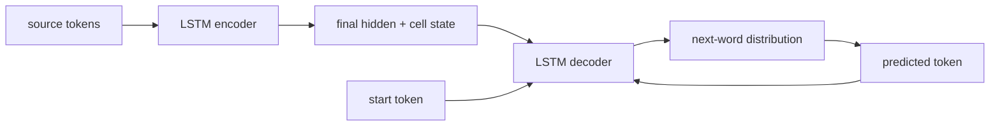
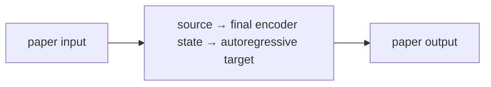

# Sequence to Sequence Learning with Neural Networks

**Sutskever, Vinyals & Le, 2014** · [Original paper](https://arxiv.org/abs/1409.3215)

## TL;DR

Seq2Seq uses one LSTM to read a source sequence and another LSTM to generate
a target sequence. The encoder passes its final state to the decoder, making a
single architecture usable for tasks such as translation. This paper showed
that a deep LSTM encoder-decoder could learn competitive English-to-French
translation end to end.

## Fun Map for First Years 🧭

source words 📥 → encoder memory 🧠 → decoder start state 🚀 → target words 📤

The encoder is like compressing a sentence into a travel summary; the decoder
uses that summary to write the sentence in another language. During training,
the decoder is shown the previous correct target word, a practice technique
called teacher forcing.

💻 **CS analogy:** The encoder returns a serialized request context; the
decoder consumes that context to emit a variable-length response.

## Math Playground 🧮

The key factorization is p(y|x) = product over t of p(y_t | y_before_t, x).

```text
p(y | x) = ∏_t p(y_t | y_1, …, y_(t-1), x)
```

Instead of predicting an entire translation at once, the decoder predicts one
next token conditioned on the source and earlier target tokens. Multiplying
these probabilities rewards a model only when it keeps making compatible
choices through the whole output.

## Background: What Came Before 🕰️

Phrase-based translation assembled outputs from hand-engineered statistical
components. Early neural sequence models also struggled to represent
variable-length input and output in one trainable system.

LSTM memory enabled an encoder to summarize an input and a decoder to emit a
new sequence. Its fixed final vector later revealed a bottleneck, motivating
Bahdanau attention in paper 33.

## Why It Matters

The encoder-decoder pattern became a general recipe for translation,
summarization, speech, and structured generation. It separated “understand the
input” from “produce an output,” so the two sides could have different lengths
and vocabularies. It is the direct ancestor of modern Transformer
encoder-decoder systems, even though later systems replace recurrent state
with attention-based representations.

## Core Intuition

The encoder reads until it has context; the decoder then writes one step at a
time. A longer input must still fit into the final encoder state, which is both
the idea's strength and its central limitation. Translating a short phrase is
like passing a compact function argument; translating a long paragraph asks
that one argument to preserve names, order, negation, and style at once.

## The Mechanism

An embedding layer feeds an LSTM encoder. Its final hidden and cell states
initialize an LSTM decoder; the decoder output distribution is projected over
the vocabulary. With two layers, both state tensors have a layer dimension and
must be transferred consistently. At inference, its own previous prediction
replaces the teacher-forced token, exposing the train/inference mismatch.




### Mechanism in Code

At implementation level, the mechanism operates on source sequence, encoder state, decoder state, and EOS. A faithful
forward pass should follow this order: encode once, initialize decoder, teacher-force during training, and feed predictions at inference. Keep the intermediate
representation available while debugging; collapsing everything into one
opaque framework call makes shape and numerical errors much harder to isolate.

The key production failure to guard against is forgetting that teacher forcing hides exposure bias during training. Add a tiny
reference test with hand-checkable values, then add a property test that
covers padding, empty/short inputs, boundary probabilities, and the largest
supported shape. Compare intermediate tensors with tolerances appropriate to
the dtype, and log the paper-specific statistic during a canary rollout.


## Practical Engineering Notes

### Worked Math & Dataflow

The compact view below makes the paper's central calculation concrete:

```text
p(y|x)=∏_t p(y_t|y<t,x)
```

In practice, the calculation is a pipeline: The decoder turns a variable-length conditional distribution into a loop: each output becomes context for the next. Teacher forcing supplies the correct previous token during training. The important engineering
choice is to preserve the paper's intended invariant while making the operation
fit the available memory, batch size, and evaluation protocol.




Use length masks, padding, beam search, and vocabulary handling in production.
Teacher forcing stabilizes optimization but creates exposure bias: one bad
early token can put the decoder on an unfamiliar path at serving time. Track
sequence lengths separately from token ids, mask loss after the end marker,
and define beam-search termination and length normalization explicitly. Long
inputs expose the fixed-vector bottleneck.

## Runnable Code Example

### Run from the repository root

Prerequisites: Python 3 and the dependencies imported by [`implementations/32-sequence-to-sequence-learning/code/seq2seq_lstm.py`](implementations/32-sequence-to-sequence-learning/code/seq2seq_lstm.py).
The example is intentionally small enough to run on CPU; it is a teaching
implementation, not a production training or serving benchmark.

```bash
python3 implementations/32-sequence-to-sequence-learning/code/seq2seq_lstm.py
```

### What the example demonstrates

Read the module docstring first, then follow the functions implementing
**LSTM encoder-decoder autoregressive generation**. The program turns `p(y|x)=∏_tp(y_t|y<t,x)` into executable operations,
prints a compact result, and checks that **teacher-forced training and inference use compatible token boundaries while decoder state is initialized correctly**. The assertion matters:
it tests the semantic contract near the mechanism instead of treating a
plausible final number as proof that the implementation is correct.

### Expected behavior and useful experiments

The command should finish without a traceback and print a successful summary
or assertion message. You should observe the paper-specific behavior, not a
particular random numeric value. Change one input at a time: inspect the
intermediate tensor or state, rerun with a boundary case, and then compare the
result with the expected invariant. A useful first experiment is to **compare teacher-forced loss with greedy and beam outputs on exact fixtures**.

### Production connection

The toy program does not model every distributed or large-scale concern. In a
real service, version the preprocessing and configuration, record the relevant
intermediate statistic, and measure peak memory, throughput, p95/p99 latency,
and task quality. The first production guard should target **exposure bias, EOS errors, or beam-search state aliasing**;
preserve a transparent reference path or a canary comparison before replacing
it with a fused, distributed, or highly optimized implementation.

## Common Misconceptions & Pitfalls

- **Misconception: `p(y|x)=∏_tp(y_t|y<t,x)` is the whole implementation.** The equation describes the paper's central relationship, but `LSTM encoder-decoder autoregressive generation` also requires explicit input contracts, ordering, masking or sampling rules, and numerical choices. If those details are left implicit, two implementations can share the same formula and still produce different results. Treat the equation as a contract and document each intermediate tensor or state transition.
- **Misconception: the mechanism is automatically reliable when the final metric looks good.** A model can compensate for a wrong reduction, stale state, or malformed edge/token boundary on common examples. The local guard is **teacher-forced training and inference use compatible token boundaries while decoder state is initialized correctly**. Check it on a tiny hand-worked fixture and on adversarial inputs before trusting an aggregate benchmark.
- **Pitfall: optimizing the operation before measuring its actual bottleneck.** For this paper, watch for **exposure bias, EOS errors, or beam-search state aliasing** rather than assuming the largest theoretical term dominates every workload. Record memory, bandwidth, batch shape, tail latency, and quality slices. An optimization is only safe when it preserves the paper-specific contract and has a rollback path.
- **Pitfall: debugging only the final prediction.** Start with **compare teacher-forced loss with greedy and beam outputs on exact fixtures**; compare intermediate values with a simple reference. Freeze preprocessing, configuration, seeds, and model versions; then bisect the first divergence. This makes a failure reproducible and distinguishes data-contract errors from numerical instability, integration bugs, and a genuinely unsuitable paper mechanism.

## Quick Concept Checks

**Q:** What is the central idea behind **LSTM encoder-decoder autoregressive generation**?
**A:** It is a structured data or optimization path, not a slogan: inputs are transformed, paper-specific relationships are computed, invalid choices are excluded when necessary, and the result is aggregated into an output or objective. The important implementation question is which intermediate values must remain observable so a reviewer can connect the code to the paper.

**Q:** How should I read `p(y|x)=∏_tp(y_t|y<t,x)`?
**A:** Read each symbol as an operation with a shape, a data source, and a numerical range. Ask what changes when its scale, temperature, rank, timestep, neighborhood, or other paper-specific value changes. Then make a two- or three-example fixture where the expected result can be calculated by hand; this catches notation-to-code misunderstandings early.

**Q:** What invariant must a correct implementation preserve?
**A:** It must preserve **teacher-forced training and inference use compatible token boundaries while decoder state is initialized correctly**. This is stronger than asking whether accuracy improved because it is local, deterministic, and testable near the operation that could be wrong. Assert it at the boundary, compare against a small reference implementation, and include the unusual input shape most likely to violate it in production.

**Q:** What is the most dangerous failure mode?
**A:** The first risk to investigate is **exposure bias, EOS errors, or beam-search state aliasing**. It can produce plausible outputs while degrading only a slice of traffic, so monitor a paper-specific statistic alongside quality and system metrics. A canary should compare the old and new paths on identical inputs and should retain enough intermediate diagnostics to explain a regression.

**Q:** How would I test this idea beyond a happy-path unit test?
**A:** Begin with **compare teacher-forced loss with greedy and beam outputs on exact fixtures**, then add differential tests against a transparent reference on small randomized inputs. Cover boundaries such as padding, termination, empty neighborhoods, long sequences, rare tokens, extreme values, or duplicated examples when they apply. Test both output values and gradients or state updates when training behavior is part of the paper's claim.

**Q:** What should I remember when applying the paper in a real system?
**A:** Keep the paper's assumptions in the production contract: version the preprocessing and configuration, expose the relevant intermediate statistic, and define quality slices before tuning performance. Compare throughput, peak memory, p95/p99 latency, and task quality against a baseline. The paper is useful only when its mechanism remains correct under the workload and failure modes you actually operate.

## Interview Q&A

**Q:** Walk through **LSTM encoder-decoder autoregressive generation** end to end. How would you implement `p(y|x)=∏_tp(y_t|y<t,x)`?
**A:** Decompose the expression into the actual data path: inputs enter the paper-specific transformation, intermediate scores or states are computed, invalid elements are excluded, and the result is reduced into the output or loss. For this paper, `p(y|x)=∏_tp(y_t|y<t,x)` is an executable contract, not decoration: document tensor shapes, ownership of mutable state, numerical precision, and where batching changes semantics. Keep a small reference implementation beside the optimized path so a reviewer can connect each line of `code` to one term in the equation.

**Follow-up:** What invariant would you assert, and why is it stronger than checking final accuracy?
**A:** Assert that **teacher-forced training and inference use compatible token boundaries while decoder state is initialized correctly**. That property is local enough to fail near the defect, whereas accuracy can remain acceptable while a mask, reduction, or state boundary is wrong on a rare input. Add a hand-computed fixture, a randomized differential test against the reference, and shape/dtype assertions at the API boundary. The test should also cover an empty, padded, terminal, high-degree, long-context, or otherwise adversarial case when that input is meaningful for this mechanism.

**Q:** What is the main production trade-off in this paper, and how would you capacity-plan it?
**A:** The central trade-off is that **the mechanism changes both quality behavior and resource use**. Capacity planning therefore needs more than average FLOPs: measure peak memory, memory bandwidth, communication, preprocessing, batch-size sensitivity, and p95/p99 latency on representative distributions. Define a quality budget before optimizing, then compare a simple baseline with the paper mechanism using identical inputs and seeds. A faster path that silently changes tokenization, routing, masking, sampling, or optimization behavior is not an acceptable optimization until its quality impact is measured.

**Follow-up:** Which failure mode would make you roll back first?
**A:** Roll back on evidence of **exposure bias, EOS errors, or beam-search state aliasing**, especially when the symptom is silent and outputs still look plausible. Add dashboards for the paper-specific statistic, error and timeout rates, resource saturation, and a task metric sliced by difficult inputs. Use a canary or shadow comparison with the previous implementation, retain the old path behind a flag, and make the rollback decision threshold explicit before deployment. The important SDE2 judgment is to protect the paper’s semantic contract, not merely to chase a faster benchmark.

**Q:** A model passes unit tests but fails in production. What is your debugging plan?
**A:** Start with **compare teacher-forced loss with greedy and beam outputs on exact fixtures**. Reproduce the smallest production-shaped example, freeze the model and preprocessing versions, and compare intermediate tensors or records rather than only the final prediction. Check data contracts, masks, sequence boundaries, random seeds, numerical precision, and serving mode in that order; then bisect between the reference and optimized implementations. If the defect is not numerical, run a controlled ablation that removes the paper-specific mechanism and compare the resulting failure rate, which separates integration problems from a bad mechanism or configuration.

**Follow-up:** What evidence would you present in the review or postmortem?
**A:** Present one minimal failing input, the expected **teacher-forced training and inference use compatible token boundaries while decoder state is initialized correctly**, the first intermediate value that diverged, and the regression test that now protects it. Include a before/after table for task quality, memory, throughput, p95/p99 latency, and cost, with slices for the failure population. A complete SDE2 answer also states the rollout guard, owner, and alert threshold. That turns a paper idea into an operable system rather than a one-line claim about an equation.

## Further Reading

- [Original paper](https://arxiv.org/abs/1409.3215)
- [LSTM](https://doi.org/10.1162/neco.1997.9.8.1735)
- [Bahdanau attention](https://arxiv.org/abs/1409.0473)
