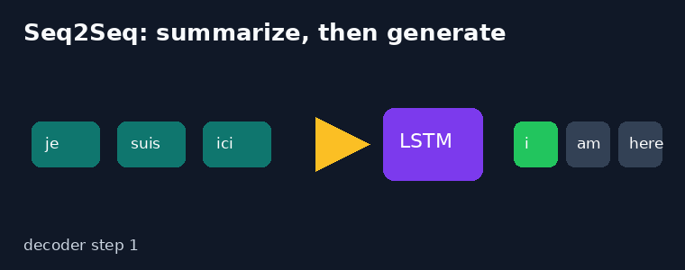
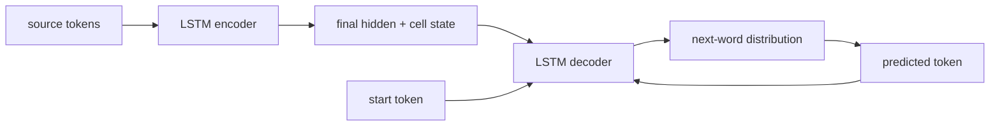
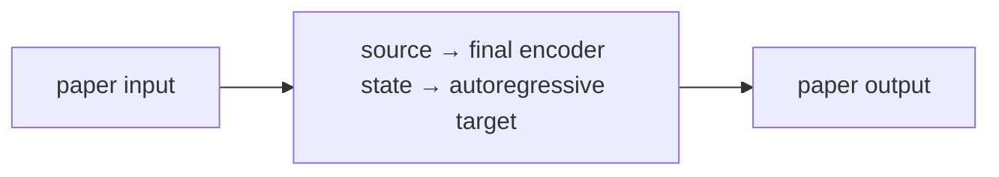
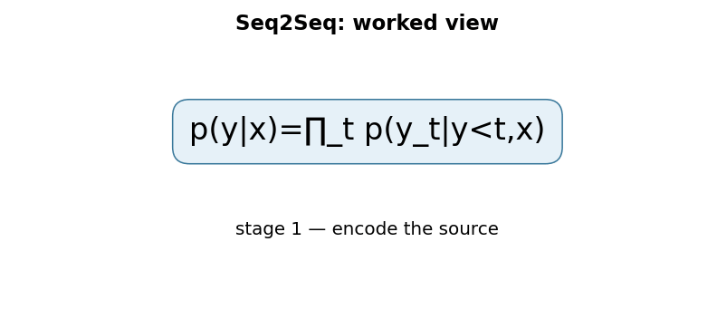

# Sequence to Sequence Learning with Neural Networks

**Sutskever, Vinyals & Le, 2014** · [Original paper](https://arxiv.org/abs/1409.3215)

## TL;DR

Seq2Seq uses one LSTM to read a source sequence and another LSTM to generate
a target sequence. The encoder passes its final state to the decoder, making a
single architecture usable for tasks such as translation. This paper showed
that a deep LSTM encoder-decoder could learn competitive English-to-French
translation end to end.

## Fun Map for First Years 🧭

source words 📥 → encoder memory 🧠 → decoder start state 🚀 → target words 📤

The encoder is like compressing a sentence into a travel summary; the decoder
uses that summary to write the sentence in another language. During training,
the decoder is shown the previous correct target word, a practice technique
called teacher forcing.

💻 **CS analogy:** The encoder returns a serialized request context; the
decoder consumes that context to emit a variable-length response.

## Math Playground 🧮

The key factorization is p(y|x) = product over t of p(y_t | y_before_t, x).

```text
p(y | x) = ∏_t p(y_t | y_1, …, y_(t-1), x)
```

Instead of predicting an entire translation at once, the decoder predicts one
next token conditioned on the source and earlier target tokens. Multiplying
these probabilities rewards a model only when it keeps making compatible
choices through the whole output.

## Background: What Came Before 🕰️

Phrase-based translation assembled outputs from hand-engineered statistical
components. Early neural sequence models also struggled to represent
variable-length input and output in one trainable system.

LSTM memory enabled an encoder to summarize an input and a decoder to emit a
new sequence. Its fixed final vector later revealed a bottleneck, motivating
Bahdanau attention in paper 33.

## Why It Matters

The encoder-decoder pattern became a general recipe for translation,
summarization, speech, and structured generation. It separated “understand the
input” from “produce an output,” so the two sides could have different lengths
and vocabularies. It is the direct ancestor of modern Transformer
encoder-decoder systems, even though later systems replace recurrent state
with attention-based representations.

## Core Intuition

The encoder reads until it has context; the decoder then writes one step at a
time. A longer input must still fit into the final encoder state, which is both
the idea's strength and its central limitation. Translating a short phrase is
like passing a compact function argument; translating a long paragraph asks
that one argument to preserve names, order, negation, and style at once.

## The Mechanism

An embedding layer feeds an LSTM encoder. Its final hidden and cell states
initialize an LSTM decoder; the decoder output distribution is projected over
the vocabulary. With two layers, both state tensors have a layer dimension and
must be transferred consistently. At inference, its own previous prediction
replaces the teacher-forced token, exposing the train/inference mismatch.





### Mechanism in Code

At implementation level, the mechanism operates on source sequence, encoder state, decoder state, and EOS. A faithful
forward pass should follow this order: encode once, initialize decoder, teacher-force during training, and feed predictions at inference. Keep the intermediate
representation available while debugging; collapsing everything into one
opaque framework call makes shape and numerical errors much harder to isolate.

The key production failure to guard against is forgetting that teacher forcing hides exposure bias during training. Add a tiny
reference test with hand-checkable values, then add a property test that
covers padding, empty/short inputs, boundary probabilities, and the largest
supported shape. Compare intermediate tensors with tolerances appropriate to
the dtype, and log the paper-specific statistic during a canary rollout.


## Practical Engineering Notes

### Worked Math & Dataflow

The compact view below makes the paper's central calculation concrete:

```text
p(y|x)=∏_t p(y_t|y<t,x)
```

In practice, the calculation is a pipeline: The decoder turns a variable-length conditional distribution into a loop: each output becomes context for the next. Teacher forcing supplies the correct previous token during training. The important engineering
choice is to preserve the paper's intended invariant while making the operation
fit the available memory, batch size, and evaluation protocol.






Use length masks, padding, beam search, and vocabulary handling in production.
Teacher forcing stabilizes optimization but creates exposure bias: one bad
early token can put the decoder on an unfamiliar path at serving time. Track
sequence lengths separately from token ids, mask loss after the end marker,
and define beam-search termination and length normalization explicitly. Long
inputs expose the fixed-vector bottleneck.

## Runnable Code Example

Run python3 implementations/32-sequence-to-sequence-learning/code/seq2seq_lstm.py.
It packs a padded source batch, initializes a two-layer decoder from the
encoder's final state, and computes teacher-forced cross-entropy loss. It then
uses greedy_decode to feed predicted tokens back at inference, making the
training-versus-generation difference explicit.

## Common Misconceptions & Pitfalls

- The original system does not attend to all encoder states at every decode
  step; that is the next paper's contribution.
- Teacher forcing during training differs from autoregressive inference.

## Quick Concept Checks

**Q:** What connects encoder and decoder?  
**A:** The encoder final LSTM state initializes the decoder.

**Q:** Why is output length flexible?  
**A:** The decoder emits one token at a time until an end marker.

**Q:** What is teacher forcing?  
**A:** Feeding the true previous target token during training.

**Q:** What bottleneck did this reveal?  
**A:** One fixed vector must represent the full source sequence.

**Q:** What fixed that bottleneck?  
**A:** Soft attention over encoder states.

## Deeper Mechanism and Engineering

The encoder processes source tokens in order and returns its final hidden and
cell states. Those two tensors are not merely features appended to a decoder
input; they initialize the decoder recurrence. The first decoder step begins
with a start token, produces a distribution over vocabulary items, and then
uses a prior target token to advance. Training commonly supplies the true prior
token, while generation feeds the model's own chosen token back in.

That train-inference difference creates exposure bias. A decoder trained only
on correct histories may make one early mistake at inference and then receive
a prefix it never saw in training. Beam search partly addresses this by
tracking several likely partial outputs, but it increases compute and can still
prefer fluent yet incorrect sequences. Length normalization, end-token rules,
and vocabulary constraints are therefore product decisions, not minor details.

The fixed encoder vector is a useful compression test. For a short command,
one state can preserve subject, action, and important modifiers. As source
length grows, the decoder must retrieve many independent details from a single
state. Translation quality can degrade because a distant name, negation, or
phrase boundary competes for the same limited representation. This observed
pressure motivated the attention mechanism in the next paper.

Input reversal in the original work is historically instructive. Reversing
source tokens reduced the temporal distance between early decoder predictions
and relevant source information, making optimization easier without changing
the model's basic capacity. It illustrates that sequence order affects the
gradient path in recurrent systems, not merely the human-facing presentation.

In production, source and target vocabularies need explicit unknown-token,
padding, start-token, and end-token policies. Mask loss on padding, preserve
per-example lengths, and ensure evaluation decoding uses the same tokenization
rules as deployment. Teacher-forced loss can look good even when free-running
generation is weak, so evaluate decoded outputs as well as token-level loss.

The architecture is still valuable for tasks with compact inputs and outputs,
or as a teaching baseline. Modern Transformer encoder-decoders retain the same
probabilistic factorization and autoregressive decoder interface; they replace
the recurrent fixed-vector pathway with attention and parallel layer
computations.

The model learns two related jobs at once. The encoder turns a variable-length
input into state, and the decoder learns a conditional language model whose
initial state depends on that input. This separation is why the same pattern
can handle translation, code generation, question answering, or a structured
data-to-text task. The symbols differ, but the contract remains “read one
sequence, then write another.”

The probability product in the math section is scored in practice by summing
log probabilities. Logs turn multiplication into addition and avoid tiny
floating-point products. Cross-entropy loss then asks the decoder to assign
high probability to each correct next token. A full decoded sentence is only
as likely as its chain of choices, so a locally tempting early word can lead
to a poor global translation.

Beam search is a controlled alternative to greedy decoding. Greedy decoding
keeps only the single most likely next token; beam search keeps several partial
sentences and extends each. That resembles a bounded best-first search over
paths in a graph. Larger beams cost more and do not guarantee better human
quality, so production systems tune beam width, length penalties, repetition
rules, and stop conditions on representative examples.

The initial final-state handoff is also a useful failure-analysis boundary.
If the encoder state loses a name or a negation, no clever decoder vocabulary
projection can recover it reliably. Inspect performance by source length and
by rare-token rate. Those measurements make the next paper’s attention
mechanism feel necessary rather than decorative: it changes what information
the decoder can retrieve at each step.

Training pairs require disciplined preprocessing. Put a start marker before
every target and an end marker after it, then shift the target sequence by one
position so decoder input and prediction label line up. An off-by-one error can
still produce a finite loss while teaching the decoder to predict the current
token from itself. Small hand-checked examples are more valuable than a large
silent training job at this stage.

The original model’s LSTM layers are recurrent, so encoder work is inherently
ordered across source positions and decoder work is ordered across targets.
Batching handles several examples at once, not arbitrary time steps from the
same example. This matters when estimating latency: decoding a 40-token output
requires roughly 40 sequential decisions even if the encoder input was already
processed.

When comparing systems, separate adequacy from fluency. A decoder can produce
smooth target-language text that omits an important source detail, especially
when the fixed vector is overloaded. Human evaluation, targeted contrast sets,
and source-length slices expose that failure better than a single aggregate
token accuracy. Attention addresses access to source detail, but faithful
generation also depends on data coverage and decoding constraints.

## Implementation Walkthrough

The code packs variable-length sources, transfers both hidden and cell state,
then contrasts teacher-forced logits with greedy decoding. That distinction is
the central operational risk: a low teacher-forced loss can coexist with poor
free-running output. Test exact token shifts, end-token termination, and
length-stratified generation before optimizing beam search.

## Interview Q&A

**Q:** Walk through **LSTM encoder-decoder autoregressive generation** end to end. How would you implement `p(y|x)=∏_tp(y_t|y<t,x)`?
**A:** Decompose the expression into the actual data path: inputs enter the paper-specific transformation, intermediate scores or states are computed, invalid elements are excluded, and the result is reduced into the output or loss. For this paper, `p(y|x)=∏_tp(y_t|y<t,x)` is an executable contract, not decoration: document tensor shapes, ownership of mutable state, numerical precision, and where batching changes semantics. Keep a small reference implementation beside the optimized path so a reviewer can connect each line of `code` to one term in the equation.

**Follow-up:** What invariant would you assert, and why is it stronger than checking final accuracy?
**A:** Assert that **teacher-forced training and inference use compatible token boundaries while decoder state is initialized correctly**. That property is local enough to fail near the defect, whereas accuracy can remain acceptable while a mask, reduction, or state boundary is wrong on a rare input. Add a hand-computed fixture, a randomized differential test against the reference, and shape/dtype assertions at the API boundary. The test should also cover an empty, padded, terminal, high-degree, long-context, or otherwise adversarial case when that input is meaningful for this mechanism.

**Q:** What is the main production trade-off in this paper, and how would you capacity-plan it?
**A:** The central trade-off is that **the mechanism changes both quality behavior and resource use**. Capacity planning therefore needs more than average FLOPs: measure peak memory, memory bandwidth, communication, preprocessing, batch-size sensitivity, and p95/p99 latency on representative distributions. Define a quality budget before optimizing, then compare a simple baseline with the paper mechanism using identical inputs and seeds. A faster path that silently changes tokenization, routing, masking, sampling, or optimization behavior is not an acceptable optimization until its quality impact is measured.

**Follow-up:** Which failure mode would make you roll back first?
**A:** Roll back on evidence of **exposure bias, EOS errors, or beam-search state aliasing**, especially when the symptom is silent and outputs still look plausible. Add dashboards for the paper-specific statistic, error and timeout rates, resource saturation, and a task metric sliced by difficult inputs. Use a canary or shadow comparison with the previous implementation, retain the old path behind a flag, and make the rollback decision threshold explicit before deployment. The important SDE2 judgment is to protect the paper’s semantic contract, not merely to chase a faster benchmark.

**Q:** A model passes unit tests but fails in production. What is your debugging plan?
**A:** Start with **compare teacher-forced loss with greedy and beam outputs on exact fixtures**. Reproduce the smallest production-shaped example, freeze the model and preprocessing versions, and compare intermediate tensors or records rather than only the final prediction. Check data contracts, masks, sequence boundaries, random seeds, numerical precision, and serving mode in that order; then bisect between the reference and optimized implementations. If the defect is not numerical, run a controlled ablation that removes the paper-specific mechanism and compare the resulting failure rate, which separates integration problems from a bad mechanism or configuration.

**Follow-up:** What evidence would you present in the review or postmortem?
**A:** Present one minimal failing input, the expected **teacher-forced training and inference use compatible token boundaries while decoder state is initialized correctly**, the first intermediate value that diverged, and the regression test that now protects it. Include a before/after table for task quality, memory, throughput, p95/p99 latency, and cost, with slices for the failure population. A complete SDE2 answer also states the rollout guard, owner, and alert threshold. That turns a paper idea into an operable system rather than a one-line claim about an equation.

## Further Reading

- [Original paper](https://arxiv.org/abs/1409.3215)
- [LSTM](https://doi.org/10.1162/neco.1997.9.8.1735)
- [Bahdanau attention](https://arxiv.org/abs/1409.0473)
