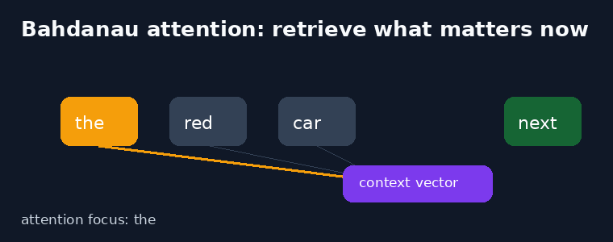
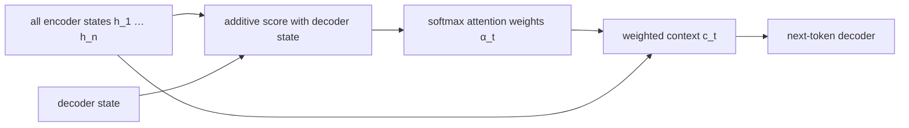

# Neural Machine Translation by Jointly Learning to Align and Translate

**Bahdanau, Cho & Bengio, 2014** · [Original paper](https://arxiv.org/abs/1409.0473)

## TL;DR

This paper adds soft attention to an encoder-decoder translation model. Rather
than compressing every source word into one final vector, the decoder learns
which encoder positions matter for each next target word. The resulting
alignment is differentiable and learned jointly with translation.

## Fun Map for First Years 🧭

source states 📚 → decoder question ❓ → relevance scores 🔦 → weighted context 🎯 → next word ✍️

When translating a word, a reader does not stare at a sentence summary; they
look back at the relevant source words. Bahdanau attention gives a decoder this
same movable focus.

💻 **CS analogy:** It is a soft database query: the decoder supplies a query,
every encoder state gets a score, and the answer is a weighted result set.

## Math Playground 🧮

The essential context is c_t = sum over i of alpha_ti times h_i.

```text
c_t = Σ_i α_(t,i) h_i,     α_(t,i) = softmax(score(s_(t-1), h_i))
```

Each h_i is an encoder state and alpha_ti is a non-negative attention weight
whose weights sum to one. A high alpha value means source position i strongly
influences the next decoder decision.

The decoder learns alpha values from its current state and every source state.
Unlike choosing one hard word location, soft weighting remains differentiable
and can blend nearby words when a translation depends on a phrase.

## Background: What Came Before 🕰️

Seq2Seq LSTMs encoded an entire source sentence into one final vector. That
works for short inputs but forces increasingly many facts into one bottleneck
as sequences grow.

This paper lets the decoder revisit all encoder states. It solved the
fixed-vector limitation and established the alignment pattern later transformed
into scaled dot-product attention.

## Why It Matters

Attention made neural translation more accurate and more interpretable at the
token level. It is the conceptual bridge between recurrent Seq2Seq systems and
the Transformer architecture.

## Core Intuition

At each output step, the decoder asks “which source positions should I read
now?” The answer is a probability distribution, not a single irreversible
pointer.

## The Mechanism

An additive scoring network compares the decoder query against each encoder
state. Softmax normalizes scores into alignment weights, and the weighted sum
becomes context for decoding. The implementation masks padded source positions
before softmax so they receive zero attention.





## Practical Engineering Notes

Mask padding before softmax or invalid tokens will absorb probability mass.
Attention costs source length per decode step; caching projected keys reduces
repeated work. Modern frameworks implement related attention in PyTorch,
TensorFlow, and JAX.

## Runnable Code Example

Run python3 implementations/33-bahdanau-attention/code/additive_attention.py.
It computes additive scores, caches encoder projections for repeated decode
steps, applies a valid-position mask, and forms weighted contexts. Its
assertions verify that each alignment sums to one and that padding receives
exactly zero probability.

## Common Misconceptions & Pitfalls

- Attention weights are useful alignment signals, not guaranteed causal
  explanations.
- Soft attention differs from a hard lookup: all valid positions can
  contribute.

## Interview Q&A

**Q:** What problem does Bahdanau attention solve?  
**A:** The fixed-length encoder-vector bottleneck in recurrent Seq2Seq.

**Q:** Why do attention weights sum to one?  
**A:** Softmax turns scores into a distribution over source positions.

**Q:** What is the context vector?  
**A:** A weighted sum of encoder states for one decoder step.

**Q:** Why mask padding?  
**A:** Padding is not source content and must not receive attention.

**Q:** How does it relate to Transformers?  
**A:** Both dynamically weight relevant sequence positions; Transformers use a
different, parallelizable scoring formulation.

## Deeper Mechanism and Engineering

The encoder emits one state for every source position instead of only its final
state. Before a decoder prediction, an alignment network compares the current
decoder state with every encoder state. Its scalar compatibility scores become
weights through softmax. The weighted sum is context, a position-specific view
of the source that is passed into the decoder's next-word computation.

This changes memory access from compression to retrieval. In fixed-vector
Seq2Seq, a decoder deciding a late target word depends on what survived one
summary. With attention, it can assign high weight to a relevant source state
at that exact step. A phrase may receive distributed weight across several
positions, which is helpful when translation depends on more than one token.

Additive attention uses learned projections and a small nonlinear scoring
network. It differs from Transformer dot-product attention but shares the
essential query, key, weight, value pattern. The decoder state is the query,
encoder states provide keys and values, weights are normalized relevance, and
the context vector is the retrieved value summary.

Masking is non-negotiable in batches. Source sentences have different lengths,
so frameworks pad short examples. If padded positions are not given negative
infinite score before softmax, they can consume attention probability and
pollute context. Correct tests check both that valid weights sum to one and
that masked weights are exactly zero.

Attention has a cost tradeoff. A recurrent decoder computes a score for every
source position at every output step, so work grows with source length times
target length. Cache projected encoder states when possible. Later
Transformer-style attention exposes more parallel computation but introduces
its own quadratic sequence-length cost.

Attention pictures can be useful diagnostics, for example when a model repeats
or skips source content. They should not be treated as proof that a particular
token caused a prediction. Weights describe one internal routing mechanism;
the full prediction also depends on decoder state, embeddings, parameters, and
nonlinear transforms.

The scoring network is called additive because it combines projected decoder
and encoder representations with addition before a small nonlinear layer. The
model need not label a source position as exactly right or wrong. Instead, it
can give 0.70 of its focus to one word and share the remaining weight across
nearby modifiers. That soft choice is key: gradient descent can adjust every
score from the translation loss without a discrete pointer decision.

The context vector is recomputed for every decoder step. When producing a
target subject, attention may favor the source subject; when producing a verb,
it can shift toward the source verb. The GIF is deliberately a simplified
picture of this shift. Real alignment is usually a dense matrix with one row
per target position and one column per source position, not a single moving
spotlight.

Softmax has a useful high-school interpretation: convert arbitrary scores into
positive shares of a fixed budget. Raising one score raises its share, but it
also lowers other shares because the total must be one. Masking says that a
padded position has no ticket in the budget at all. Apply the mask before
softmax; multiplying after normalization can leave the surviving weights
incorrectly summing to less than one.

Attention improves access, not translation data quality by itself. It can
still copy a biased or misspelled source token, attend to the wrong repeated
word, or learn a fluent shortcut. During debugging, visualize masks and
alignment rows alongside source and generated text, then test whether
attention changes correlate with the actual error. Treat it as observability,
not a complete explanation.

In code, shapes make the mechanism concrete. Encoder states commonly have
shape batch × source-length × feature-width. One decoder state becomes a
query, scores become batch × source-length, and the weighted sum returns one
context vector per batch item. Naming these axes prevents a common bug where a
softmax is accidentally taken across the feature dimension instead of across
source positions.

The paper’s bidirectional encoder gives each source representation access to
both its left and right context. That is useful in offline translation because
the encoder can read the full source sentence first. It differs from a causal
streaming encoder, which cannot inspect future tokens. When adapting attention
to another task, decide explicitly whether future context is permitted rather
than inheriting a convenient default.

This architecture is a bridge, not the final word. Its recurrent decoder still
generates one token at a time, while the score network repeats work for each
target position. Transformer attention changes the scoring form and removes
recurrent dependencies within its layers during training. Still, the central
lesson survives: a representation can be a searchable collection, not only a
single compressed summary.

## Implementation Walkthrough

The implementation projects encoder states once, then reuses those keys for
multiple decoder queries. It masks invalid positions before softmax and checks
that their probability is zero. In a full translation model, log the alignment
matrix with source and target tokens; it helps diagnose repeated, skipped, or
misaligned content without claiming a causal explanation.

## Further Reading

- [Original paper](https://arxiv.org/abs/1409.0473)
- [Seq2Seq](https://arxiv.org/abs/1409.3215)
- [Attention Is All You Need](https://arxiv.org/abs/1706.03762)
