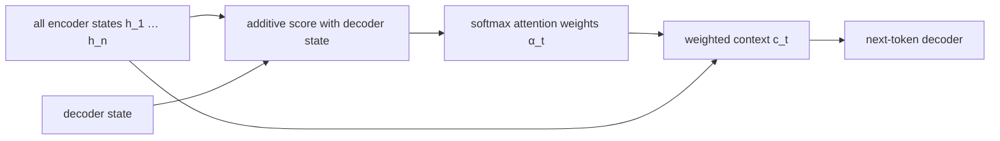
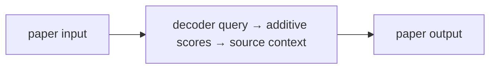
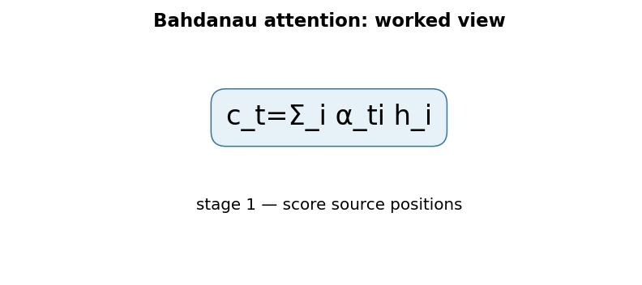

# Neural Machine Translation by Jointly Learning to Align and Translate

**Bahdanau, Cho & Bengio, 2014** · [Original paper](https://arxiv.org/abs/1409.0473)

## 1. TL;DR
This paper adds soft attention to an encoder-decoder translation model. Rather
than compressing every source word into one final vector, the decoder learns
which encoder positions matter for each next target word. The resulting
alignment is differentiable and learned jointly with translation.

## 2. Fun Map for First Years
source states 📚 → decoder question ❓ → relevance scores 🔦 → weighted context 🎯 → next word ✍️

When translating a word, a reader does not stare at a sentence summary; they
look back at the relevant source words. Bahdanau attention gives a decoder this
same movable focus.

💻 **CS analogy:** It is a soft database query: the decoder supplies a query,
every encoder state gets a score, and the answer is a weighted result set.

### Beginner walkthrough

Read the arrows as a sequence of responsibilities. First identify what enters
the system, then ask what the paper changes, what information is preserved or
discarded, and what leaves the operation. For **additive attention alignment between decoder state and encoder outputs**, the key question
is not “does the model sound clever?” but “which intermediate value carries the
new information, and what would go wrong if it were missing?”

### CS student checkpoint

The map corresponds to a small program: input data enters a function, the
paper-specific state or transformation runs, and an assertion checks **alignment scores are masked before softmax and context uses the same source positions**.
The equation `c_t=Σ_iα_tih_i` is the compact specification for that function. Trace
one concrete item through each arrow before thinking about larger batches,
parallel hardware, or production optimizations.

## 3. Math Playground
The essential context is c_t = sum over i of alpha_ti times h_i.

```text
c_t = Σ_i α_(t,i) h_i,     α_(t,i) = softmax(score(s_(t-1), h_i))
```

Each h_i is an encoder state and alpha_ti is a non-negative attention weight
whose weights sum to one. A high alpha value means source position i strongly
influences the next decoder decision.

The decoder learns alpha values from its current state and every source state.
Unlike choosing one hard word location, soft weighting remains differentiable
and can blend nearby words when a translation depends on a phrase.

## 4. Background: What Came Before
Seq2Seq LSTMs encoded an entire source sentence into one final vector. That
works for short inputs but forces increasingly many facts into one bottleneck
as sequences grow.

This paper lets the decoder revisit all encoder states. It solved the
fixed-vector limitation and established the alignment pattern later transformed
into scaled dot-product attention.

## 5. Why It Matters
Attention made neural translation more accurate by allowing each decoder step
to retrieve source details instead of relying on one compressed vector. It is
also a useful inspection surface: a heatmap can show which source positions
received weight, although that weight is not automatically a faithful causal
explanation. The method is the conceptual bridge between recurrent Seq2Seq
systems and the Transformer architecture.

## 6. Core Intuition
At each output step, the decoder asks “which source positions should I read
now?” The answer is a probability distribution, not a single irreversible
pointer. When a target word depends on a two-word phrase, the context can blend
both encoder states; when it depends on one name, the distribution can become
sharply concentrated.

## 7. The Mechanism
An additive scoring network compares the decoder query against each encoder
state. It projects both vectors, applies a nonlinear combination, and reduces
that combination to one scalar score per source position. Softmax normalizes
scores into alignment weights, and the weighted sum becomes context for
decoding. The implementation masks padded source positions before softmax so
they receive zero attention; masking after softmax would incorrectly leave
their probability mass in the normalization.




### Mechanism in Code

At implementation level, the mechanism operates on decoder state and every valid encoder state. A faithful
forward pass should follow this order: project query/keys, score additively, mask padding, normalize, and form context. Keep the intermediate
representation available while debugging; collapsing everything into one
opaque framework call makes shape and numerical errors much harder to isolate.

The key production failure to guard against is normalizing over padded positions or assuming an alignment is a causal proof. Add a tiny
reference test with hand-checkable values, then add a property test that
covers padding, empty/short inputs, boundary probabilities, and the largest
supported shape. Compare intermediate tensors with tolerances appropriate to
the dtype, and log the paper-specific statistic during a canary rollout.


## 8. Practical Engineering Notes
### Worked Math & Dataflow

The compact view below makes the paper's central calculation concrete:

```text
c_t=Σ_i α_ti h_i
```

In practice, the calculation is a pipeline: The decoder computes a fresh source summary at every output step. Alignment weights are normalized over valid source positions, so a longer input does not have to fit into one final vector. The important engineering
choice is to preserve the paper's intended invariant while making the operation
fit the available memory, batch size, and evaluation protocol.






Mask padding before softmax or invalid tokens will absorb probability mass.
Attention costs source length per decode step; caching projected keys reduces
repeated work. Modern frameworks implement related attention in PyTorch,
TensorFlow, and JAX.

## 9. Runnable Code Example
### Run from the repository root

Prerequisites: Python 3 and the dependencies imported by [`implementations/33-bahdanau-attention/code/additive_attention.py`](implementations/33-bahdanau-attention/code/additive_attention.py).
The example is intentionally small enough to run on CPU; it is a teaching
implementation, not a production training or serving benchmark.

```bash
python3 implementations/33-bahdanau-attention/code/additive_attention.py
```

### What the example demonstrates

Read the module docstring first, then follow the functions implementing
**additive attention alignment between decoder state and encoder outputs**. The program turns `c_t=Σ_iα_tih_i` into executable operations,
prints a compact result, and checks that **alignment scores are masked before softmax and context uses the same source positions**. The assertion matters:
it tests the semantic contract near the mechanism instead of treating a
plausible final number as proof that the implementation is correct.

### Expected behavior and useful experiments

The command should finish without a traceback and print a successful summary
or assertion message. You should observe the paper-specific behavior, not a
particular random numeric value. Change one input at a time: inspect the
intermediate tensor or state, rerun with a boundary case, and then compare the
result with the expected invariant. A useful first experiment is to **test mask-before-softmax and alignment on synthetic sequences with known dependencies**.

### Production connection

The toy program does not model every distributed or large-scale concern. In a
real service, version the preprocessing and configuration, record the relevant
intermediate statistic, and measure peak memory, throughput, p95/p99 latency,
and task quality. The first production guard should target **attention on padding or a fixed-vector bottleneck reappearing through bad state handling**;
preserve a transparent reference path or a canary comparison before replacing
it with a fused, distributed, or highly optimized implementation.

## 10. Common Misconceptions & Pitfalls
- **Misconception: `c_t=Σ_iα_tih_i` is the whole implementation.** The equation describes the paper's central relationship, but `additive attention alignment between decoder state and encoder outputs` also requires explicit input contracts, ordering, masking or sampling rules, and numerical choices. If those details are left implicit, two implementations can share the same formula and still produce different results. Treat the equation as a contract and document each intermediate tensor or state transition.
- **Misconception: the mechanism is automatically reliable when the final metric looks good.** A model can compensate for a wrong reduction, stale state, or malformed edge/token boundary on common examples. The local guard is **alignment scores are masked before softmax and context uses the same source positions**. Check it on a tiny hand-worked fixture and on adversarial inputs before trusting an aggregate benchmark.
- **Pitfall: optimizing the operation before measuring its actual bottleneck.** For this paper, watch for **attention on padding or a fixed-vector bottleneck reappearing through bad state handling** rather than assuming the largest theoretical term dominates every workload. Record memory, bandwidth, batch shape, tail latency, and quality slices. An optimization is only safe when it preserves the paper-specific contract and has a rollback path.
- **Pitfall: debugging only the final prediction.** Start with **test mask-before-softmax and alignment on synthetic sequences with known dependencies**; compare intermediate values with a simple reference. Freeze preprocessing, configuration, seeds, and model versions; then bisect the first divergence. This makes a failure reproducible and distinguishes data-contract errors from numerical instability, integration bugs, and a genuinely unsuitable paper mechanism.

## 11. Quick Concept Checks
**Q:** What is the central idea behind **additive attention alignment between decoder state and encoder outputs**?
**A:** It is a structured data or optimization path, not a slogan: inputs are transformed, paper-specific relationships are computed, invalid choices are excluded when necessary, and the result is aggregated into an output or objective. The important implementation question is which intermediate values must remain observable so a reviewer can connect the code to the paper.

**Q:** How should I read `c_t=Σ_iα_tih_i`?
**A:** Read each symbol as an operation with a shape, a data source, and a numerical range. Ask what changes when its scale, temperature, rank, timestep, neighborhood, or other paper-specific value changes. Then make a two- or three-example fixture where the expected result can be calculated by hand; this catches notation-to-code misunderstandings early.

**Q:** What invariant must a correct implementation preserve?
**A:** It must preserve **alignment scores are masked before softmax and context uses the same source positions**. This is stronger than asking whether accuracy improved because it is local, deterministic, and testable near the operation that could be wrong. Assert it at the boundary, compare against a small reference implementation, and include the unusual input shape most likely to violate it in production.

**Q:** What is the most dangerous failure mode?
**A:** The first risk to investigate is **attention on padding or a fixed-vector bottleneck reappearing through bad state handling**. It can produce plausible outputs while degrading only a slice of traffic, so monitor a paper-specific statistic alongside quality and system metrics. A canary should compare the old and new paths on identical inputs and should retain enough intermediate diagnostics to explain a regression.

**Q:** How would I test this idea beyond a happy-path unit test?
**A:** Begin with **test mask-before-softmax and alignment on synthetic sequences with known dependencies**, then add differential tests against a transparent reference on small randomized inputs. Cover boundaries such as padding, termination, empty neighborhoods, long sequences, rare tokens, extreme values, or duplicated examples when they apply. Test both output values and gradients or state updates when training behavior is part of the paper's claim.

**Q:** What should I remember when applying the paper in a real system?
**A:** Keep the paper's assumptions in the production contract: version the preprocessing and configuration, expose the relevant intermediate statistic, and define quality slices before tuning performance. Compare throughput, peak memory, p95/p99 latency, and task quality against a baseline. The paper is useful only when its mechanism remains correct under the workload and failure modes you actually operate.

## 12. Interview Q&A
**Q:** Walk through **additive attention alignment between decoder state and encoder outputs** end to end. How would you implement `c_t=Σ_iα_tih_i`?
**A:** Decompose the expression into the actual data path: inputs enter the paper-specific transformation, intermediate scores or states are computed, invalid elements are excluded, and the result is reduced into the output or loss. For this paper, `c_t=Σ_iα_tih_i` is an executable contract, not decoration: document tensor shapes, ownership of mutable state, numerical precision, and where batching changes semantics. Keep a small reference implementation beside the optimized path so a reviewer can connect each line of `code` to one term in the equation.

**Follow-up:** What invariant would you assert, and why is it stronger than checking final accuracy?
**A:** Assert that **alignment scores are masked before softmax and context uses the same source positions**. That property is local enough to fail near the defect, whereas accuracy can remain acceptable while a mask, reduction, or state boundary is wrong on a rare input. Add a hand-computed fixture, a randomized differential test against the reference, and shape/dtype assertions at the API boundary. The test should also cover an empty, padded, terminal, high-degree, long-context, or otherwise adversarial case when that input is meaningful for this mechanism.

**Q:** What is the main production trade-off in this paper, and how would you capacity-plan it?
**A:** The central trade-off is that **the mechanism changes both quality behavior and resource use**. Capacity planning therefore needs more than average FLOPs: measure peak memory, memory bandwidth, communication, preprocessing, batch-size sensitivity, and p95/p99 latency on representative distributions. Define a quality budget before optimizing, then compare a simple baseline with the paper mechanism using identical inputs and seeds. A faster path that silently changes tokenization, routing, masking, sampling, or optimization behavior is not an acceptable optimization until its quality impact is measured.

**Follow-up:** Which failure mode would make you roll back first?
**A:** Roll back on evidence of **attention on padding or a fixed-vector bottleneck reappearing through bad state handling**, especially when the symptom is silent and outputs still look plausible. Add dashboards for the paper-specific statistic, error and timeout rates, resource saturation, and a task metric sliced by difficult inputs. Use a canary or shadow comparison with the previous implementation, retain the old path behind a flag, and make the rollback decision threshold explicit before deployment. The important SDE2 judgment is to protect the paper’s semantic contract, not merely to chase a faster benchmark.

**Q:** A model passes unit tests but fails in production. What is your debugging plan?
**A:** Start with **test mask-before-softmax and alignment on synthetic sequences with known dependencies**. Reproduce the smallest production-shaped example, freeze the model and preprocessing versions, and compare intermediate tensors or records rather than only the final prediction. Check data contracts, masks, sequence boundaries, random seeds, numerical precision, and serving mode in that order; then bisect between the reference and optimized implementations. If the defect is not numerical, run a controlled ablation that removes the paper-specific mechanism and compare the resulting failure rate, which separates integration problems from a bad mechanism or configuration.

**Follow-up:** What evidence would you present in the review or postmortem?
**A:** Present one minimal failing input, the expected **alignment scores are masked before softmax and context uses the same source positions**, the first intermediate value that diverged, and the regression test that now protects it. Include a before/after table for task quality, memory, throughput, p95/p99 latency, and cost, with slices for the failure population. A complete SDE2 answer also states the rollout guard, owner, and alert threshold. That turns a paper idea into an operable system rather than a one-line claim about an equation.

## 13. Further Reading
- [Original paper](https://arxiv.org/abs/1409.0473)
- [Seq2Seq](https://arxiv.org/abs/1409.3215)
- [Attention Is All You Need](https://arxiv.org/abs/1706.03762)
