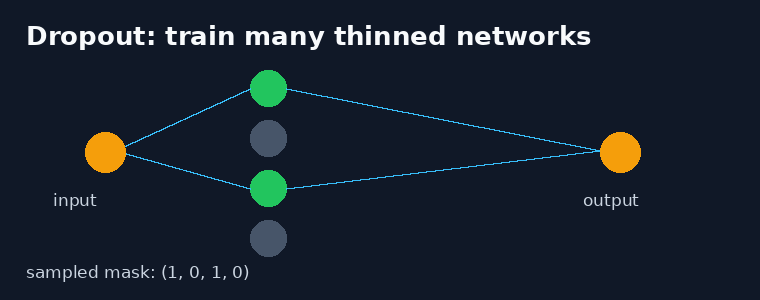
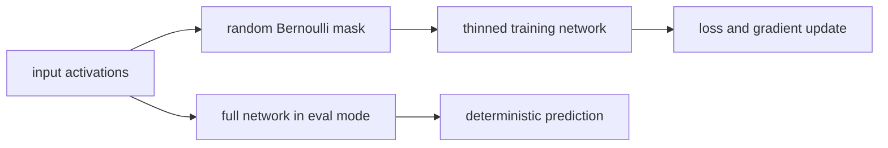
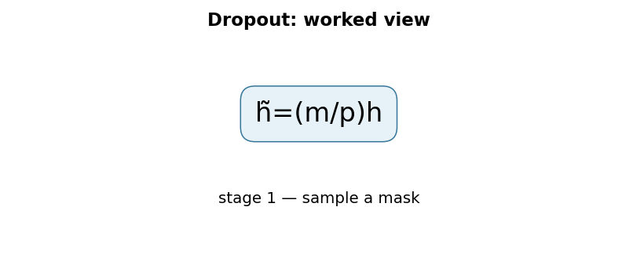

# Dropout: A Simple Way to Prevent Neural Networks from Overfitting

**Srivastava et al., 2014** · [Original paper](https://www.jmlr.org/papers/v15/srivastava14a.html)

## TL;DR

Dropout randomly removes units and their connections during training. Each
training step therefore uses a different thinned network, making it harder for
features to rely on fragile co-adaptations. At inference, the full network is
used deterministically with suitable scaling.

## Fun Map for First Years 🧭

full network 🕸️ → random mask 🎲 → thinned network 🧩 → learn robust features 💪 → full inference ✅

It is like practicing a group presentation while randomly asking some speakers
to sit out. The remaining speakers must understand the material instead of
depending on one teammate to rescue every answer.

💻 **CS analogy:** Dropout resembles fault-injection testing: temporarily
disable components while training so the overall system does not depend on one
fragile path.

## Math Playground 🧮

The training transform is h_tilde = m * h / p, where each mask value m is zero
or one and p is the probability of keeping a unit.

```text
m_i ~ Bernoulli(p),     h̃_i = (m_i / p) h_i
```

Dividing by p is called inverted dropout. It keeps the expected activation
scale the same during training and evaluation, so inference does not need a
separate output rescaling step.

## Background: What Came Before 🕰️

Large neural networks can memorize quirks of a finite training set. Earlier
countermeasures included weight decay, early stopping, and manually training
many independent models for an ensemble.

Dropout approximates an ensemble of many thinned networks in one training run.
It became a simple default regularizer across vision, language, and tabular
neural models.

## Why It Matters

Dropout made regularization practical without storing or serving many models.
It remains common in dense layers and attention-related architectures, though
its best rate depends on model, data, normalization, and augmentation. The
useful comparison is a matched validation experiment: if training loss rises
slightly while validation loss improves, the noise is buying generalization.

## Core Intuition

Every mask changes which feature combinations are available. A useful unit
therefore learns to work with many possible companions instead of specializing
to one accidental training correlation. For an image classifier, this can
discourage a prediction from depending on one isolated texture detector; for a
small tabular model, the same rate may instead erase too much signal.

## The Mechanism

For each training batch, independent Bernoulli samples choose retained units.
The sampled activations pass through the rest of the network and only the
active subnetwork receives that pass's gradient. At evaluation, dropout is
disabled, making the model deterministic. Inverted scaling keeps the expected
activation magnitude aligned between the two modes.





### Mechanism in Code

At implementation level, the mechanism operates on activation tensor and Bernoulli mask. A faithful
forward pass should follow this order: sample a fresh mask in training, apply inverted scaling, and disable masks in evaluation. Keep the intermediate
representation available while debugging; collapsing everything into one
opaque framework call makes shape and numerical errors much harder to isolate.

The key production failure to guard against is exporting a model still in training mode. Add a tiny
reference test with hand-checkable values, then add a property test that
covers padding, empty/short inputs, boundary probabilities, and the largest
supported shape. Compare intermediate tensors with tolerances appropriate to
the dtype, and log the paper-specific statistic during a canary rollout.


## Practical Engineering Notes

### Worked Math & Dataflow

The compact view below makes the paper's central calculation concrete:

```text
h̃=(m/p)h
```

In practice, the calculation is a pipeline: A new mask samples a different thinned network on each training pass. Scaling retained units by 1/p keeps their expected activation unchanged, which makes evaluation mode a clean deterministic switch. The important engineering
choice is to preserve the paper's intended invariant while making the operation
fit the available memory, batch size, and evaluation protocol.





Call model.train for stochastic masks and model.eval for deterministic
inference in PyTorch. Do not leave dropout enabled during validation unless
doing deliberate uncertainty sampling. Tune the probability with validation
data; excessive dropout causes underfitting. Check its placement around
normalization layers, because changing the order changes the statistics seen
by the rest of the network.

## Runnable Code Example

### Run from the repository root

Prerequisites: Python 3 and the dependencies imported by [`implementations/34-dropout/code/dropout_training.py`](implementations/34-dropout/code/dropout_training.py).
The example is intentionally small enough to run on CPU; it is a teaching
implementation, not a production training or serving benchmark.

```bash
python3 implementations/34-dropout/code/dropout_training.py
```

### What the example demonstrates

Read the module docstring first, then follow the functions implementing
**inverted dropout during training**. The program turns `h̃=(m/p)h` into executable operations,
prints a compact result, and checks that **training is stochastic while evaluation is deterministic and expected activation scale is preserved**. The assertion matters:
it tests the semantic contract near the mechanism instead of treating a
plausible final number as proof that the implementation is correct. The classifier performs a real parameter update before the mode checks, so this is more than a static API demonstration.

### Expected behavior and useful experiments

The command should finish without a traceback and print a successful summary
or assertion message. You should observe the paper-specific behavior, not a
particular random numeric value. Change one input at a time: inspect the
intermediate tensor or state, rerun with a boundary case, and then compare the
result with the expected invariant. A useful first experiment is to **assert stochastic train outputs, deterministic eval outputs, and mean-preserving scale**.

### Production connection

The toy program does not model every distributed or large-scale concern. In a
real service, version the preprocessing and configuration, record the relevant
intermediate statistic, and measure peak memory, throughput, p95/p99 latency,
and task quality. The first production guard should target **dropout left enabled at serving or inconsistent rate placement across branches**;
preserve a transparent reference path or a canary comparison before replacing
it with a fused, distributed, or highly optimized implementation.

## Common Misconceptions & Pitfalls

- **Misconception: `h̃=(m/p)h` is the whole implementation.** The equation describes the paper's central relationship, but `inverted dropout during training` also requires explicit input contracts, ordering, masking or sampling rules, and numerical choices. If those details are left implicit, two implementations can share the same formula and still produce different results. Treat the equation as a contract and document each intermediate tensor or state transition.
- **Misconception: the mechanism is automatically reliable when the final metric looks good.** A model can compensate for a wrong reduction, stale state, or malformed edge/token boundary on common examples. The local guard is **training is stochastic while evaluation is deterministic and expected activation scale is preserved**. Check it on a tiny hand-worked fixture and on adversarial inputs before trusting an aggregate benchmark.
- **Pitfall: optimizing the operation before measuring its actual bottleneck.** For this paper, watch for **dropout left enabled at serving or inconsistent rate placement across branches** rather than assuming the largest theoretical term dominates every workload. Record memory, bandwidth, batch shape, tail latency, and quality slices. An optimization is only safe when it preserves the paper-specific contract and has a rollback path.
- **Pitfall: debugging only the final prediction.** Start with **assert stochastic train outputs, deterministic eval outputs, and mean-preserving scale**; compare intermediate values with a simple reference. Freeze preprocessing, configuration, seeds, and model versions; then bisect the first divergence. This makes a failure reproducible and distinguishes data-contract errors from numerical instability, integration bugs, and a genuinely unsuitable paper mechanism.

## Quick Concept Checks

**Q:** What is the central idea behind **inverted dropout during training**?
**A:** It is a structured data or optimization path, not a slogan: inputs are transformed, paper-specific relationships are computed, invalid choices are excluded when necessary, and the result is aggregated into an output or objective. The important implementation question is which intermediate values must remain observable so a reviewer can connect the code to the paper.

**Q:** How should I read `h̃=(m/p)h`?
**A:** Read each symbol as an operation with a shape, a data source, and a numerical range. Ask what changes when its scale, temperature, rank, timestep, neighborhood, or other paper-specific value changes. Then make a two- or three-example fixture where the expected result can be calculated by hand; this catches notation-to-code misunderstandings early.

**Q:** What invariant must a correct implementation preserve?
**A:** It must preserve **training is stochastic while evaluation is deterministic and expected activation scale is preserved**. This is stronger than asking whether accuracy improved because it is local, deterministic, and testable near the operation that could be wrong. Assert it at the boundary, compare against a small reference implementation, and include the unusual input shape most likely to violate it in production.

**Q:** What is the most dangerous failure mode?
**A:** The first risk to investigate is **dropout left enabled at serving or inconsistent rate placement across branches**. It can produce plausible outputs while degrading only a slice of traffic, so monitor a paper-specific statistic alongside quality and system metrics. A canary should compare the old and new paths on identical inputs and should retain enough intermediate diagnostics to explain a regression.

**Q:** How would I test this idea beyond a happy-path unit test?
**A:** Begin with **assert stochastic train outputs, deterministic eval outputs, and mean-preserving scale**, then add differential tests against a transparent reference on small randomized inputs. Cover boundaries such as padding, termination, empty neighborhoods, long sequences, rare tokens, extreme values, or duplicated examples when they apply. Test both output values and gradients or state updates when training behavior is part of the paper's claim.

**Q:** What should I remember when applying the paper in a real system?
**A:** Keep the paper's assumptions in the production contract: version the preprocessing and configuration, expose the relevant intermediate statistic, and define quality slices before tuning performance. Compare throughput, peak memory, p95/p99 latency, and task quality against a baseline. The paper is useful only when its mechanism remains correct under the workload and failure modes you actually operate.

## Interview Q&A

**Q:** Walk through **inverted dropout during training** end to end. How would you implement `h̃=(m/p)h`?
**A:** Decompose the expression into the actual data path: inputs enter the paper-specific transformation, intermediate scores or states are computed, invalid elements are excluded, and the result is reduced into the output or loss. For this paper, `h̃=(m/p)h` is an executable contract, not decoration: document tensor shapes, ownership of mutable state, numerical precision, and where batching changes semantics. Keep a small reference implementation beside the optimized path so a reviewer can connect each line of `code` to one term in the equation.

**Follow-up:** What invariant would you assert, and why is it stronger than checking final accuracy?
**A:** Assert that **training is stochastic while evaluation is deterministic and expected activation scale is preserved**. That property is local enough to fail near the defect, whereas accuracy can remain acceptable while a mask, reduction, or state boundary is wrong on a rare input. Add a hand-computed fixture, a randomized differential test against the reference, and shape/dtype assertions at the API boundary. The test should also cover an empty, padded, terminal, high-degree, long-context, or otherwise adversarial case when that input is meaningful for this mechanism.

**Q:** What is the main production trade-off in this paper, and how would you capacity-plan it?
**A:** The central trade-off is that **the mechanism changes both quality behavior and resource use**. Capacity planning therefore needs more than average FLOPs: measure peak memory, memory bandwidth, communication, preprocessing, batch-size sensitivity, and p95/p99 latency on representative distributions. Define a quality budget before optimizing, then compare a simple baseline with the paper mechanism using identical inputs and seeds. A faster path that silently changes tokenization, routing, masking, sampling, or optimization behavior is not an acceptable optimization until its quality impact is measured.

**Follow-up:** Which failure mode would make you roll back first?
**A:** Roll back on evidence of **dropout left enabled at serving or inconsistent rate placement across branches**, especially when the symptom is silent and outputs still look plausible. Add dashboards for the paper-specific statistic, error and timeout rates, resource saturation, and a task metric sliced by difficult inputs. Use a canary or shadow comparison with the previous implementation, retain the old path behind a flag, and make the rollback decision threshold explicit before deployment. The important SDE2 judgment is to protect the paper’s semantic contract, not merely to chase a faster benchmark.

**Q:** A model passes unit tests but fails in production. What is your debugging plan?
**A:** Start with **assert stochastic train outputs, deterministic eval outputs, and mean-preserving scale**. Reproduce the smallest production-shaped example, freeze the model and preprocessing versions, and compare intermediate tensors or records rather than only the final prediction. Check data contracts, masks, sequence boundaries, random seeds, numerical precision, and serving mode in that order; then bisect between the reference and optimized implementations. If the defect is not numerical, run a controlled ablation that removes the paper-specific mechanism and compare the resulting failure rate, which separates integration problems from a bad mechanism or configuration.

**Follow-up:** What evidence would you present in the review or postmortem?
**A:** Present one minimal failing input, the expected **training is stochastic while evaluation is deterministic and expected activation scale is preserved**, the first intermediate value that diverged, and the regression test that now protects it. Include a before/after table for task quality, memory, throughput, p95/p99 latency, and cost, with slices for the failure population. A complete SDE2 answer also states the rollout guard, owner, and alert threshold. That turns a paper idea into an operable system rather than a one-line claim about an equation.

## Further Reading

- [Original paper](https://www.jmlr.org/papers/v15/srivastava14a.html)
- [Batch Normalization](https://arxiv.org/abs/1502.03167)
- [Adam](https://arxiv.org/abs/1412.6980)
