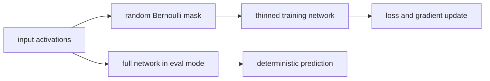
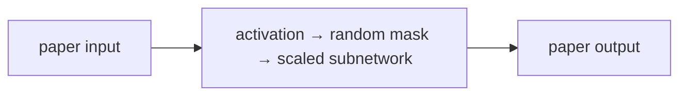

# Dropout: A Simple Way to Prevent Neural Networks from Overfitting

**Srivastava et al., 2014** · [Original paper](https://www.jmlr.org/papers/v15/srivastava14a.html)

## TL;DR

Dropout randomly removes units and their connections during training. Each
training step therefore uses a different thinned network, making it harder for
features to rely on fragile co-adaptations. At inference, the full network is
used deterministically with suitable scaling.

## Fun Map for First Years 🧭

full network 🕸️ → random mask 🎲 → thinned network 🧩 → learn robust features 💪 → full inference ✅

It is like practicing a group presentation while randomly asking some speakers
to sit out. The remaining speakers must understand the material instead of
depending on one teammate to rescue every answer.

💻 **CS analogy:** Dropout resembles fault-injection testing: temporarily
disable components while training so the overall system does not depend on one
fragile path.

## Math Playground 🧮

The training transform is h_tilde = m * h / p, where each mask value m is zero
or one and p is the probability of keeping a unit.

```text
m_i ~ Bernoulli(p),     h̃_i = (m_i / p) h_i
```

Dividing by p is called inverted dropout. It keeps the expected activation
scale the same during training and evaluation, so inference does not need a
separate output rescaling step.

## Background: What Came Before 🕰️

Large neural networks can memorize quirks of a finite training set. Earlier
countermeasures included weight decay, early stopping, and manually training
many independent models for an ensemble.

Dropout approximates an ensemble of many thinned networks in one training run.
It became a simple default regularizer across vision, language, and tabular
neural models.

## Why It Matters

Dropout made regularization practical without storing or serving many models.
It remains common in dense layers and attention-related architectures, though
its best rate depends on model, data, normalization, and augmentation. The
useful comparison is a matched validation experiment: if training loss rises
slightly while validation loss improves, the noise is buying generalization.

## Core Intuition

Every mask changes which feature combinations are available. A useful unit
therefore learns to work with many possible companions instead of specializing
to one accidental training correlation. For an image classifier, this can
discourage a prediction from depending on one isolated texture detector; for a
small tabular model, the same rate may instead erase too much signal.

## The Mechanism

For each training batch, independent Bernoulli samples choose retained units.
The sampled activations pass through the rest of the network and only the
active subnetwork receives that pass's gradient. At evaluation, dropout is
disabled, making the model deterministic. Inverted scaling keeps the expected
activation magnitude aligned between the two modes.




### Mechanism in Code

At implementation level, the mechanism operates on activation tensor and Bernoulli mask. A faithful
forward pass should follow this order: sample a fresh mask in training, apply inverted scaling, and disable masks in evaluation. Keep the intermediate
representation available while debugging; collapsing everything into one
opaque framework call makes shape and numerical errors much harder to isolate.

The key production failure to guard against is exporting a model still in training mode. Add a tiny
reference test with hand-checkable values, then add a property test that
covers padding, empty/short inputs, boundary probabilities, and the largest
supported shape. Compare intermediate tensors with tolerances appropriate to
the dtype, and log the paper-specific statistic during a canary rollout.


## Practical Engineering Notes

### Worked Math & Dataflow

The compact view below makes the paper's central calculation concrete:

```text
h̃=(m/p)h
```

In practice, the calculation is a pipeline: A new mask samples a different thinned network on each training pass. Scaling retained units by 1/p keeps their expected activation unchanged, which makes evaluation mode a clean deterministic switch. The important engineering
choice is to preserve the paper's intended invariant while making the operation
fit the available memory, batch size, and evaluation protocol.




Call model.train for stochastic masks and model.eval for deterministic
inference in PyTorch. Do not leave dropout enabled during validation unless
doing deliberate uncertainty sampling. Tune the probability with validation
data; excessive dropout causes underfitting. Check its placement around
normalization layers, because changing the order changes the statistics seen
by the rest of the network.

## Runnable Code Example

Run python3 implementations/34-dropout/code/dropout_training.py.
It performs a real classifier update with sampled masks, then verifies that
two training-mode outputs differ while two evaluation-mode outputs match.
Switching model.train and model.eval is the key production behavior to notice.

## Common Misconceptions & Pitfalls

- Dropout is not the same as permanently pruning a network.
- More dropout is not always better; too much blocks useful capacity.

## Quick Concept Checks

**Q:** Why does dropout reduce overfitting?  
**A:** It discourages units from relying on narrow co-adaptations.

**Q:** When is dropout active?  
**A:** During training, not ordinary deterministic inference.

**Q:** What is inverted dropout?  
**A:** Scaling retained activations by inverse keep probability at training time.

**Q:** Does it replace data augmentation?  
**A:** No; they regularize in different ways and can complement each other.

**Q:** Why use eval mode?  
**A:** It disables random masks for repeatable predictions.

## Deeper Mechanism and Engineering

During a training pass, each eligible activation receives an independent
Bernoulli mask. A zero removes that activation's contribution for that pass;
a retained activation is scaled by inverse keep probability in the common
inverted-dropout convention. Across updates, the optimizer therefore sees many
related subnetworks sharing the same parameters.

The ensemble interpretation is useful but should be stated carefully. Dropout
does not explicitly train and save every possible subnetwork. Instead, shared
parameters receive gradients from randomly sampled thinned versions. At
inference, the unmasked network is an efficient approximation to averaging
those related models. Inverted scaling ensures its activation magnitude does
not suddenly change between train and evaluation modes.

Consider a feature that fires only when another specific feature fires. Without
regularization, a classifier can rely on that accidental pair even if it is a
training-set coincidence. Randomly dropping either feature makes that shortcut
unreliable. Learning pressure shifts toward redundant evidence and features
that remain helpful in several subnetworks.

The hyperparameter is retention probability, or equivalently dropout
probability. Inputs are commonly dropped less aggressively than hidden units.
Very high dropout can make a small model underfit; very low dropout may not
change an overfit model enough. Tune it with a validation set and assess
calibration, accuracy, and loss rather than treating a conventional value as a
universal rule.

Normalization layers change the interaction. Batch normalization already
introduces batch-dependent behavior, and dropout before or after it can change
running statistics. Modern architectures often use dropout selectively in
residual branches, embeddings, or attention weights rather than placing it
after every layer. The correct placement follows the architecture and measured
validation behavior.

For reproducible experiments, record the seed, train/eval mode, probability,
and framework version. For deterministic serving, call evaluation mode before
export or prediction. Leaving training mode enabled produces random outputs,
which can look like flaky infrastructure rather than a model-mode bug.

The mask is sampled anew during training, not once at model creation. A unit
that is absent in one batch can participate in the next. This is why dropout
is a training-time perturbation rather than architectural pruning. The model
cannot safely assign one important concept to a single fragile route, because
that route may disappear before the next gradient update.

Inverted scaling looks like a small implementation detail but prevents a large
mode-switch surprise. If only half of values survive and are not scaled, the
average activation entering later layers is about half as large during
training. Dividing survivors by the keep probability restores the expected
scale. It is analogous to distributing a team’s expected workload among fewer
people on a randomly selected shift.

Dropout regularizes different components in different ways. Dropping image
pixels, embedding dimensions, hidden units, residual branches, or attention
weights changes the noise injected into the computation. The original paper
popularized unit dropout, but a modern architecture may use structured variants
or no dropout when data augmentation, weight decay, and scale already provide
enough regularization. Validation data should decide.

To test an implementation, make two forward passes in training mode with the
same input and expect variation, then repeat in evaluation mode and expect
equality. Seed randomness when reproducing an experiment, but avoid assuming
one seed proves a rate is good. Compare train-versus-validation curves: a
large gap suggests overfitting, while both poor curves suggest capacity, data,
or optimization trouble rather than a need for more masking.

Dropout also changes the effective optimization problem. Gradients arrive from
slightly different subnetworks on each update, so loss curves can be noisier.
That noise is purposeful regularization, not automatically a stability bug.
Use a learning-rate schedule and enough training steps to judge validation
behavior fairly; stopping early just because one training batch gets worse can
confuse random masking with true divergence.

The original paper discusses applying dropout to visible units as well as
hidden units, but input corruption must fit the modality. Removing random
pixels can be sensible for images, while deleting token embeddings may damage
short text. Structured dropout that removes channels, spans, or heads changes
the failure mode. Pick a perturbation that reflects the shortcuts you want the
model to stop using, then validate that it does not erase the signal entirely.

At serving time, standard dropout has no runtime ensemble cost because it is
off. If deliberately left on for many predictions, the spread of outputs can
be used as a rough uncertainty heuristic called Monte Carlo dropout. That is a
different product choice: it needs repeated inference, aggregation, and
calibration evaluation. Do not accidentally present random single-pass output
as uncertainty-aware behavior.

Dropout should be measured against a no-dropout control with the same data
split, seed range, optimizer, and training budget. If validation quality
improves while training quality falls slightly, the regularizer is doing its
intended job. If both collapse, reduce the rate or revisit the model and data.
This comparison keeps “randomness helped” from becoming an unsupported story.

## Implementation Walkthrough

The example deliberately runs the same batch twice in training and evaluation
mode. Training outputs should differ because masks are resampled; evaluation
outputs should match because inverted scaling already corrected expected
activation size. This simple test catches a common deployment bug where a
model is exported while still in training mode.

## Interview Q&A

These prompts are designed for a second-level software engineering interview: explain the mechanism, name the operational trade-off, and describe how you would test it.

**Q:** Walk through inverted dropout regularization end to end. What does `h̃=(m/p)h` mean in an implementation?
**A:** Start by identifying the data structure entering the operation, the learned or configured values it uses, and the invariant that must hold at the output. In this paper, h̃=(m/p)h is not just notation: it tells you what is compared, normalized, accumulated, or optimized. A strong implementation makes those stages visible in separate functions, keeps tensor shapes and dtypes explicit, and tests a tiny hand-computed example before optimizing. Explain what happens when the inputs are short, padded, empty, or unusually large; those cases often reveal whether the code actually matches the paper.

**Follow-up:** Which invariant would you assert?
**A:** Assert the property that makes the method meaningful: probabilities normalize over valid choices, a residual preserves shape, a target does not bootstrap past termination, or an update leaves frozen state untouched. The assertion should be local and cheap enough to run in tests, not an end-to-end hope such as “accuracy improves.” Also compare the optimized path with a simple reference on random small inputs using an appropriate tolerance. That catches indexing, masking, reduction, and broadcasting errors while the failing example is still understandable.

**Q:** What is the main production trade-off, and how would you capacity-plan it?
**A:** The practical trade-off here is training noise can improve generalization with no serving ensemble cost, but rates and placement are architecture-dependent. Estimate both arithmetic work and memory movement, then identify whether the service is compute-bound, bandwidth-bound, latency-bound, or limited by coordination. Include batch-size effects, peak activation/state memory, serialization, and cold-start behavior; average throughput can hide a bad tail latency. Choose a baseline configuration, measure it on representative shapes, and document which quality metric is allowed to move. If the system is distributed, include communication and retry behavior rather than treating the model operation as an isolated kernel.

**Follow-up:** What would make you reject an apparently faster optimization?
**A:** Reject it when it changes the evaluation contract, weakens isolation, creates silent quality regressions, or only wins on a synthetic shape. For this paper, watch especially for leaving training mode enabled or combining poorly with normalization. A safe rollout uses a reference implementation, shadow traffic or canaries, resource limits, and dashboards for both system and model metrics. Keep the old path available until numerical outputs, error rates, p95/p99 latency, and cost are stable across the important input distributions.

**Q:** How would you debug a model that passes unit tests but fails in production?
**A:** Reproduce the smallest production-shaped input and compare intermediate values against the reference path, not only the final score. Log versioned preprocessing, shapes, masks, random seeds where relevant, and the exact model/configuration identifiers; otherwise a numerical symptom can be caused by data drift or a serving mismatch. Separate failures into data, numerical stability, optimization, and infrastructure categories. For this method, begin with assert stochastic train outputs and deterministic eval outputs, then run a controlled ablation that disables the paper-specific mechanism to determine whether the regression is in the mechanism or its integration.

**Follow-up:** What evidence would you present in the postmortem or interview?
**A:** Show one minimal failing example, the expected invariant, the observed intermediate divergence, and the fix’s regression test. Add a before/after metric table covering quality, memory, throughput, and tail latency, plus the rollout guard that would catch recurrence. This demonstrates engineering judgment: the goal is not merely to identify a clever algorithm, but to make its behavior observable, reproducible, and safe to operate.


## Further Reading

- [Original paper](https://www.jmlr.org/papers/v15/srivastava14a.html)
- [Batch Normalization](https://arxiv.org/abs/1502.03167)
- [Adam](https://arxiv.org/abs/1412.6980)
