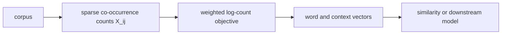
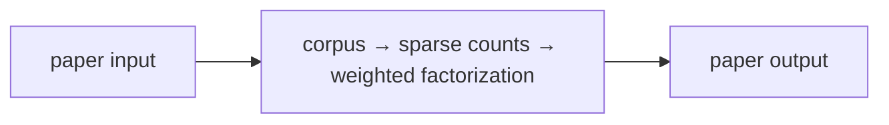

# GloVe: Global Vectors for Word Representation

**Pennington, Socher & Manning, 2014** · EMNLP 2014

## 1. TL;DR
GloVe learns word vectors from global word co-occurrence counts. It fits dot
products between word and context vectors to the logarithm of observed counts,
with a weighting function that prevents very rare or very frequent pairs from
dominating. The result captures useful semantic and syntactic relationships in
a compact vector space.

## 2. Fun Map for First Years
text corpus 📚 → nearby-word counts 🔢 → weighted statistics ⚖️ → vectors 📍 → similarity and analogies 🔗

If “ice” often appears near “cold” and “steam” near “hot,” their count
patterns contain meaning even without labeled definitions. GloVe turns these
shared neighborhood patterns into positions in vector space.

💻 **CS analogy:** A co-occurrence matrix is like a sparse service-usage table;
matrix factorization compresses recurring usage patterns into small feature
vectors.

### Beginner walkthrough

Read the arrows as a sequence of responsibilities. First identify what enters
the system, then ask what the paper changes, what information is preserved or
discarded, and what leaves the operation. For **weighted factorization of global word co-occurrence counts**, the key question
is not “does the model sound clever?” but “which intermediate value carries the
new information, and what would go wrong if it were missing?”

### CS student checkpoint

The map corresponds to a small program: input data enters a function, the
paper-specific state or transformation runs, and an assertion checks **count construction, weighting cutoff, and bias terms use the same vocabulary snapshot**.
The equation `wᵀw̃+b+b̃≈logX` is the compact specification for that function. Trace
one concrete item through each arrow before thinking about larger batches,
parallel hardware, or production optimizations.

## 3. Math Playground
The central goal is w_i dot w_tilde_j plus b_i plus b_tilde_j approximately
equals log of X_ij.

```text
J = Σ_(i,j) f(X_ij) [w_iᵀ w̃_j + b_i + b̃_j − log(X_ij)]²
```

X_ij is the number of times word i occurs near context word j. A dot product
acts as a compatibility score. Taking a logarithm makes huge raw count
differences easier to fit, while GloVe weights each pair to limit extremes.

## 4. Background: What Came Before
Count-based distributional methods used large co-occurrence matrices, while
predictive methods such as word2vec learned embeddings by predicting local
contexts. Both observed that nearby-word statistics encode useful meaning.

GloVe combined global counts with a vector-learning objective. It gave a
simple way to factorize corpus-wide statistics while retaining small dense
embeddings useful in downstream models.

## 5. Why It Matters
GloVe became a standard pretrained embedding source and a clear demonstration
of how global corpus structure can become vectors. It complements paper 16,
word2vec, which emphasizes local predictive training. The contrast is useful:
GloVe starts with an explicit sparse statistical object, while word2vec learns
from sampled prediction events without directly reconstructing that matrix.

## 6. Core Intuition
Words are represented by how their context distributions compare, not by their
spelling. The important signal is often a ratio: a context that is common near
“ice” but not “steam” helps distinguish the two. Common words such as “the”
can appear beside almost everything, so relative patterns are more informative
than one raw count.

## 7. The Mechanism
The model keeps separate word and context embeddings plus biases. For each
nonzero co-occurrence pair it minimizes a weighted squared error between its
score and the log count. The weighting function grows for small counts and
then caps, limiting both one-off noise and very frequent function-word pairs.
After training, word and context representations are often combined for
downstream use.




### Mechanism in Code

At implementation level, the mechanism operates on sparse word-context pairs, counts, vectors, and biases. A faithful
forward pass should follow this order: build window counts, apply distance/weight functions, fit log counts, and combine embeddings. Keep the intermediate
representation available while debugging; collapsing everything into one
opaque framework call makes shape and numerical errors much harder to isolate.

The key production failure to guard against is materializing a vocabulary-square matrix or changing tokenization between runs. Add a tiny
reference test with hand-checkable values, then add a property test that
covers padding, empty/short inputs, boundary probabilities, and the largest
supported shape. Compare intermediate tensors with tolerances appropriate to
the dtype, and log the paper-specific statistic during a canary rollout.


## 8. Practical Engineering Notes
### Worked Math & Dataflow

The compact view below makes the paper's central calculation concrete:

```text
wᵀw̃+b+b̃≈log X
```

In practice, the calculation is a pipeline: The objective fits observed sparse counts in log space with separate word and context vectors. A weighting function prevents rare noise and extremely frequent pairs from dominating the geometry. The important engineering
choice is to preserve the paper's intended invariant while making the operation
fit the available memory, batch size, and evaluation protocol.




Build sparse co-occurrence tables with a defined window and distance weighting.
Avoid materializing a full vocabulary-square matrix: the possible pair count
grows quadratically with vocabulary size while observed window pairs are much
sparser. Pretrained embeddings need vocabulary, casing, and licensing checks;
static embeddings cannot resolve different senses of the same word from
sentence context. Evaluate nearest neighbors for corpus bias, not only for
pleasant-looking analogies.

## 9. Runnable Code Example
### Run from the repository root

Prerequisites: Python 3 and the dependencies imported by [`implementations/35-glove/code/glove_weighted_least_squares.py`](implementations/35-glove/code/glove_weighted_least_squares.py).
The example is intentionally small enough to run on CPU; it is a teaching
implementation, not a production training or serving benchmark.

```bash
python3 implementations/35-glove/code/glove_weighted_least_squares.py
```

### What the example demonstrates

Read the module docstring first, then follow the functions implementing
**weighted factorization of global word co-occurrence counts**. The program turns `wᵀw̃+b+b̃≈logX` into executable operations,
prints a compact result, and checks that **count construction, weighting cutoff, and bias terms use the same vocabulary snapshot**. The assertion matters:
it tests the semantic contract near the mechanism instead of treating a
plausible final number as proof that the implementation is correct.

### Expected behavior and useful experiments

The command should finish without a traceback and print a successful summary
or assertion message. You should observe the paper-specific behavior, not a
particular random numeric value. Change one input at a time: inspect the
intermediate tensor or state, rerun with a boundary case, and then compare the
result with the expected invariant. A useful first experiment is to **snapshot counts and evaluate reconstruction plus downstream similarity and retrieval**.

### Production connection

The toy program does not model every distributed or large-scale concern. In a
real service, version the preprocessing and configuration, record the relevant
intermediate statistic, and measure peak memory, throughput, p95/p99 latency,
and task quality. The first production guard should target **corpus-count memory blow-up, rare-word noise, or separate embedding tables being mishandled**;
preserve a transparent reference path or a canary comparison before replacing
it with a fused, distributed, or highly optimized implementation.

## 10. Common Misconceptions & Pitfalls
- **Misconception: `wᵀw̃+b+b̃≈logX` is the whole implementation.** The equation describes the paper's central relationship, but `weighted factorization of global word co-occurrence counts` also requires explicit input contracts, ordering, masking or sampling rules, and numerical choices. If those details are left implicit, two implementations can share the same formula and still produce different results. Treat the equation as a contract and document each intermediate tensor or state transition.
- **Misconception: the mechanism is automatically reliable when the final metric looks good.** A model can compensate for a wrong reduction, stale state, or malformed edge/token boundary on common examples. The local guard is **count construction, weighting cutoff, and bias terms use the same vocabulary snapshot**. Check it on a tiny hand-worked fixture and on adversarial inputs before trusting an aggregate benchmark.
- **Pitfall: optimizing the operation before measuring its actual bottleneck.** For this paper, watch for **corpus-count memory blow-up, rare-word noise, or separate embedding tables being mishandled** rather than assuming the largest theoretical term dominates every workload. Record memory, bandwidth, batch shape, tail latency, and quality slices. An optimization is only safe when it preserves the paper-specific contract and has a rollback path.
- **Pitfall: debugging only the final prediction.** Start with **snapshot counts and evaluate reconstruction plus downstream similarity and retrieval**; compare intermediate values with a simple reference. Freeze preprocessing, configuration, seeds, and model versions; then bisect the first divergence. This makes a failure reproducible and distinguishes data-contract errors from numerical instability, integration bugs, and a genuinely unsuitable paper mechanism.

## 11. Quick Concept Checks
**Q:** What is the central idea behind **weighted factorization of global word co-occurrence counts**?
**A:** It is a structured data or optimization path, not a slogan: inputs are transformed, paper-specific relationships are computed, invalid choices are excluded when necessary, and the result is aggregated into an output or objective. The important implementation question is which intermediate values must remain observable so a reviewer can connect the code to the paper.

**Q:** How should I read `wᵀw̃+b+b̃≈logX`?
**A:** Read each symbol as an operation with a shape, a data source, and a numerical range. Ask what changes when its scale, temperature, rank, timestep, neighborhood, or other paper-specific value changes. Then make a two- or three-example fixture where the expected result can be calculated by hand; this catches notation-to-code misunderstandings early.

**Q:** What invariant must a correct implementation preserve?
**A:** It must preserve **count construction, weighting cutoff, and bias terms use the same vocabulary snapshot**. This is stronger than asking whether accuracy improved because it is local, deterministic, and testable near the operation that could be wrong. Assert it at the boundary, compare against a small reference implementation, and include the unusual input shape most likely to violate it in production.

**Q:** What is the most dangerous failure mode?
**A:** The first risk to investigate is **corpus-count memory blow-up, rare-word noise, or separate embedding tables being mishandled**. It can produce plausible outputs while degrading only a slice of traffic, so monitor a paper-specific statistic alongside quality and system metrics. A canary should compare the old and new paths on identical inputs and should retain enough intermediate diagnostics to explain a regression.

**Q:** How would I test this idea beyond a happy-path unit test?
**A:** Begin with **snapshot counts and evaluate reconstruction plus downstream similarity and retrieval**, then add differential tests against a transparent reference on small randomized inputs. Cover boundaries such as padding, termination, empty neighborhoods, long sequences, rare tokens, extreme values, or duplicated examples when they apply. Test both output values and gradients or state updates when training behavior is part of the paper's claim.

**Q:** What should I remember when applying the paper in a real system?
**A:** Keep the paper's assumptions in the production contract: version the preprocessing and configuration, expose the relevant intermediate statistic, and define quality slices before tuning performance. Compare throughput, peak memory, p95/p99 latency, and task quality against a baseline. The paper is useful only when its mechanism remains correct under the workload and failure modes you actually operate.

## 12. Interview Q&A
**Q:** Walk through **weighted factorization of global word co-occurrence counts** end to end. How would you implement `wᵀw̃+b+b̃≈logX`?
**A:** Decompose the expression into the actual data path: inputs enter the paper-specific transformation, intermediate scores or states are computed, invalid elements are excluded, and the result is reduced into the output or loss. For this paper, `wᵀw̃+b+b̃≈logX` is an executable contract, not decoration: document tensor shapes, ownership of mutable state, numerical precision, and where batching changes semantics. Keep a small reference implementation beside the optimized path so a reviewer can connect each line of `code` to one term in the equation.

**Follow-up:** What invariant would you assert, and why is it stronger than checking final accuracy?
**A:** Assert that **count construction, weighting cutoff, and bias terms use the same vocabulary snapshot**. That property is local enough to fail near the defect, whereas accuracy can remain acceptable while a mask, reduction, or state boundary is wrong on a rare input. Add a hand-computed fixture, a randomized differential test against the reference, and shape/dtype assertions at the API boundary. The test should also cover an empty, padded, terminal, high-degree, long-context, or otherwise adversarial case when that input is meaningful for this mechanism.

**Q:** What is the main production trade-off in this paper, and how would you capacity-plan it?
**A:** The central trade-off is that **the mechanism changes both quality behavior and resource use**. Capacity planning therefore needs more than average FLOPs: measure peak memory, memory bandwidth, communication, preprocessing, batch-size sensitivity, and p95/p99 latency on representative distributions. Define a quality budget before optimizing, then compare a simple baseline with the paper mechanism using identical inputs and seeds. A faster path that silently changes tokenization, routing, masking, sampling, or optimization behavior is not an acceptable optimization until its quality impact is measured.

**Follow-up:** Which failure mode would make you roll back first?
**A:** Roll back on evidence of **corpus-count memory blow-up, rare-word noise, or separate embedding tables being mishandled**, especially when the symptom is silent and outputs still look plausible. Add dashboards for the paper-specific statistic, error and timeout rates, resource saturation, and a task metric sliced by difficult inputs. Use a canary or shadow comparison with the previous implementation, retain the old path behind a flag, and make the rollback decision threshold explicit before deployment. The important SDE2 judgment is to protect the paper’s semantic contract, not merely to chase a faster benchmark.

**Q:** A model passes unit tests but fails in production. What is your debugging plan?
**A:** Start with **snapshot counts and evaluate reconstruction plus downstream similarity and retrieval**. Reproduce the smallest production-shaped example, freeze the model and preprocessing versions, and compare intermediate tensors or records rather than only the final prediction. Check data contracts, masks, sequence boundaries, random seeds, numerical precision, and serving mode in that order; then bisect between the reference and optimized implementations. If the defect is not numerical, run a controlled ablation that removes the paper-specific mechanism and compare the resulting failure rate, which separates integration problems from a bad mechanism or configuration.

**Follow-up:** What evidence would you present in the review or postmortem?
**A:** Present one minimal failing input, the expected **count construction, weighting cutoff, and bias terms use the same vocabulary snapshot**, the first intermediate value that diverged, and the regression test that now protects it. Include a before/after table for task quality, memory, throughput, p95/p99 latency, and cost, with slices for the failure population. A complete SDE2 answer also states the rollout guard, owner, and alert threshold. That turns a paper idea into an operable system rather than a one-line claim about an equation.

## 13. Further Reading
- [Original paper](https://aclanthology.org/D14-1162/)
- [word2vec](https://arxiv.org/abs/1301.3781)
- [SentencePiece](https://arxiv.org/abs/1808.06226)
