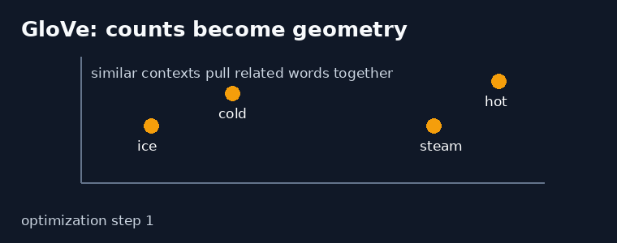
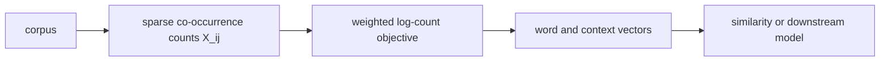
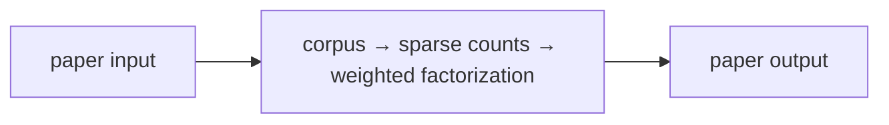
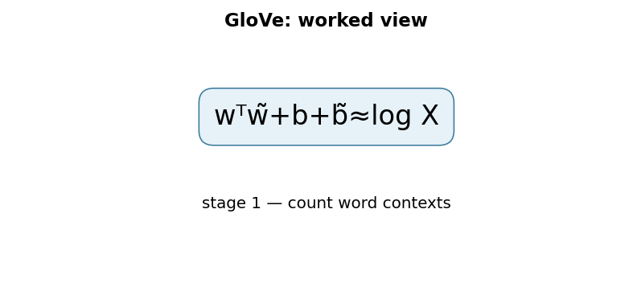

# GloVe: Global Vectors for Word Representation

**Pennington, Socher & Manning, 2014** · EMNLP 2014

## TL;DR

GloVe learns word vectors from global word co-occurrence counts. It fits dot
products between word and context vectors to the logarithm of observed counts,
with a weighting function that prevents very rare or very frequent pairs from
dominating. The result captures useful semantic and syntactic relationships in
a compact vector space.

## Fun Map for First Years 🧭

text corpus 📚 → nearby-word counts 🔢 → weighted statistics ⚖️ → vectors 📍 → similarity and analogies 🔗

If “ice” often appears near “cold” and “steam” near “hot,” their count
patterns contain meaning even without labeled definitions. GloVe turns these
shared neighborhood patterns into positions in vector space.

💻 **CS analogy:** A co-occurrence matrix is like a sparse service-usage table;
matrix factorization compresses recurring usage patterns into small feature
vectors.

## Math Playground 🧮

The central goal is w_i dot w_tilde_j plus b_i plus b_tilde_j approximately
equals log of X_ij.

```text
J = Σ_(i,j) f(X_ij) [w_iᵀ w̃_j + b_i + b̃_j − log(X_ij)]²
```

X_ij is the number of times word i occurs near context word j. A dot product
acts as a compatibility score. Taking a logarithm makes huge raw count
differences easier to fit, while GloVe weights each pair to limit extremes.

## Background: What Came Before 🕰️

Count-based distributional methods used large co-occurrence matrices, while
predictive methods such as word2vec learned embeddings by predicting local
contexts. Both observed that nearby-word statistics encode useful meaning.

GloVe combined global counts with a vector-learning objective. It gave a
simple way to factorize corpus-wide statistics while retaining small dense
embeddings useful in downstream models.

## Why It Matters

GloVe became a standard pretrained embedding source and a clear demonstration
of how global corpus structure can become vectors. It complements paper 16,
word2vec, which emphasizes local predictive training. The contrast is useful:
GloVe starts with an explicit sparse statistical object, while word2vec learns
from sampled prediction events without directly reconstructing that matrix.

## Core Intuition

Words are represented by how their context distributions compare, not by their
spelling. The important signal is often a ratio: a context that is common near
“ice” but not “steam” helps distinguish the two. Common words such as “the”
can appear beside almost everything, so relative patterns are more informative
than one raw count.

## The Mechanism

The model keeps separate word and context embeddings plus biases. For each
nonzero co-occurrence pair it minimizes a weighted squared error between its
score and the log count. The weighting function grows for small counts and
then caps, limiting both one-off noise and very frequent function-word pairs.
After training, word and context representations are often combined for
downstream use.





### Mechanism in Code

At implementation level, the mechanism operates on sparse word-context pairs, counts, vectors, and biases. A faithful
forward pass should follow this order: build window counts, apply distance/weight functions, fit log counts, and combine embeddings. Keep the intermediate
representation available while debugging; collapsing everything into one
opaque framework call makes shape and numerical errors much harder to isolate.

The key production failure to guard against is materializing a vocabulary-square matrix or changing tokenization between runs. Add a tiny
reference test with hand-checkable values, then add a property test that
covers padding, empty/short inputs, boundary probabilities, and the largest
supported shape. Compare intermediate tensors with tolerances appropriate to
the dtype, and log the paper-specific statistic during a canary rollout.


## Practical Engineering Notes

### Worked Math & Dataflow

The compact view below makes the paper's central calculation concrete:

```text
wᵀw̃+b+b̃≈log X
```

In practice, the calculation is a pipeline: The objective fits observed sparse counts in log space with separate word and context vectors. A weighting function prevents rare noise and extremely frequent pairs from dominating the geometry. The important engineering
choice is to preserve the paper's intended invariant while making the operation
fit the available memory, batch size, and evaluation protocol.






Build sparse co-occurrence tables with a defined window and distance weighting.
Avoid materializing a full vocabulary-square matrix: the possible pair count
grows quadratically with vocabulary size while observed window pairs are much
sparser. Pretrained embeddings need vocabulary, casing, and licensing checks;
static embeddings cannot resolve different senses of the same word from
sentence context. Evaluate nearest neighbors for corpus bias, not only for
pleasant-looking analogies.

## Runnable Code Example

Run python3 implementations/35-glove/code/glove_weighted_least_squares.py.
It first builds a sparse, distance-weighted co-occurrence table from a small
tokenized corpus, then optimizes word/context vectors and biases over observed
pairs only. The final assertion confirms that weighted log-count loss falls
during training.

## Common Misconceptions & Pitfalls

- GloVe is not a contextual embedding model; each word type has one vector.
- A high co-occurrence count alone is not semantic proof; corpus bias matters.

## Quick Concept Checks

**Q:** What data does GloVe learn from?  
**A:** Word-context co-occurrence counts from a corpus.

**Q:** Why use log counts?  
**A:** They compress the wide numeric range of raw frequency.

**Q:** Why have context vectors too?  
**A:** They model asymmetric word-context roles during factorization.

**Q:** How does GloVe differ from word2vec?  
**A:** GloVe explicitly fits global counts; word2vec uses a predictive objective.

**Q:** What is a major limitation?  
**A:** One static vector cannot choose a different sense per sentence.

## Deeper Mechanism and Engineering

Build a co-occurrence table by scanning a corpus with a context window. Each
time word i occurs near word j, increment X_ij, often by a distance-dependent
weight so closer neighbors count more. The table is sparse: most vocabulary
pairs never occur together, and efficient implementations iterate only over
observed pairs.

GloVe gives every vocabulary item a word vector, a context vector, and two
biases. Its predicted log count is the dot product of the two vectors plus
their biases. A weighted squared error compares that prediction with log X_ij.
The weighting function suppresses extremely rare noisy pairs and prevents a
handful of very frequent pairs from dominating optimization.

Why retain separate word and context embeddings? A word in the center and a
word in the surrounding window have related but not identical roles. The
factorization uses that asymmetry while learning. After training, applications
often add the two embeddings or choose the word embedding, but that downstream
choice should be evaluated rather than assumed.

Global statistics can reveal relationships that a local objective sees only
through individual windows. If two words have similar ratios of co-occurrence
with many contexts, their vectors can become similar even when the words rarely
appear directly beside one another. The approach remains limited by corpus
coverage, tokenization, and social bias encoded in text frequency.

In production, precompute counts with a stable tokenizer and record window
size, vocabulary cutoff, distance weighting, and corpus version. A dense
vocabulary-square array becomes impractical quickly; use sparse maps, shards,
or streaming aggregation. Validate that unknown tokens, case folding, and
punctuation handling match the downstream system.

Static embeddings are cheap and useful for small models, similarity search, or
interpretable baselines. They cannot choose different vectors for “bank” in a
river sentence versus a finance sentence. Contextual encoders solve that by
computing a representation from the full input, but they are more expensive
and do not remove corpus bias automatically.

The objective has a friendly interpretation. For every observed pair, the
model makes a prediction for the logarithm of its count. If “ice” and “cold”
occur together frequently, their word-context dot product and biases should
make a larger prediction than for a rare pair. Squaring the difference makes
large mistakes costly; the weighting function decides how much each observed
pair should influence the total lesson.

The weighting function is important because corpus counts have a long tail.
Pairs seen once may be noise, while punctuation or function-word pairs may be
so common that they crowd out everything else. GloVe increases influence up to
a chosen count threshold and then caps it. This is like a monitoring system
that listens more to repeated signals than one-off events but refuses to let a
single noisy metric dominate every dashboard decision.

Window construction determines what “context” means. A symmetric window sees
left and right neighbors; a directional window can preserve order. Weighting
nearby tokens more strongly encodes a belief that close words carry more
direct relations. These choices, vocabulary cutoff, casing, and tokenization
are part of the learned representation, so they belong in experiment metadata
and reproducible data pipelines.

The final vectors support cosine similarity because vector direction captures
a usage pattern better than raw magnitude alone. Yet a nearest-neighbor list
is an audit tool, not a certificate of meaning. Inspect for stereotypes,
unexpected tokenization fragments, and overly frequent words. For a product,
evaluate retrieval or downstream task behavior on the people and language
varieties that actually matter, then consider contextual models when one static
vector per word is too coarse.

The paper motivates ratios of co-occurrence probabilities because they make
comparisons sharper. A context word such as “solid” may be much more likely
near “ice” than “steam,” while “gas” reverses that contrast. A raw count does
not tell the whole story because common context words appear beside almost
everything. Relative patterns are what let an embedding separate related but
different concepts.

Training samples only nonzero entries of the sparse table. That is a major
engineering saving: a vocabulary of 100,000 words has ten billion possible
pairs, but most do not occur in a realistic window. Store integer ids and
counts, batch observed pairs, and monitor the weighted objective separately
from downstream quality. A lower reconstruction loss is useful evidence, not
a guarantee that the vectors help a classifier or retrieval service.

GloVe sits in an instructive historical middle ground. It has an explicit
statistical object—the corpus count matrix—like classical distributional
semantics, but it learns dense vectors with gradient descent like neural
methods. That clarity is why it remains a good baseline and teaching tool.
Modern contextual models add flexibility, yet global-count embeddings can be
smaller, easier to inspect, and appropriate when compute or data is limited.

## Implementation Walkthrough

The code constructs only observed window pairs, applies inverse-distance
weights, and learns separate word/context embeddings plus biases. This is the
sparse version of the paper's objective; a dense count matrix would waste
memory on absent pairs. After fitting, inspect neighbors and downstream
retrieval, because reducing log-count reconstruction loss alone does not
guarantee useful semantics.

## Interview Q&A

These prompts are designed for a second-level software engineering interview: explain the mechanism, name the operational trade-off, and describe how you would test it.

**Q:** Walk through weighted global co-occurrence factorization end to end. What does `wᵀw̃+b+b̃≈logX` mean in an implementation?
**A:** Start by identifying the data structure entering the operation, the learned or configured values it uses, and the invariant that must hold at the output. In this paper, wᵀw̃+b+b̃≈logX is not just notation: it tells you what is compared, normalized, accumulated, or optimized. A strong implementation makes those stages visible in separate functions, keeps tensor shapes and dtypes explicit, and tests a tiny hand-computed example before optimizing. Explain what happens when the inputs are short, padded, empty, or unusually large; those cases often reveal whether the code actually matches the paper.

**Follow-up:** Which invariant would you assert?
**A:** Assert the property that makes the method meaningful: probabilities normalize over valid choices, a residual preserves shape, a target does not bootstrap past termination, or an update leaves frozen state untouched. The assertion should be local and cheap enough to run in tests, not an end-to-end hope such as “accuracy improves.” Also compare the optimized path with a simple reference on random small inputs using an appropriate tolerance. That catches indexing, masking, reduction, and broadcasting errors while the failing example is still understandable.

**Q:** What is the main production trade-off, and how would you capacity-plan it?
**A:** The practical trade-off here is sparse observed pairs avoid a vocabulary-square matrix, but corpus construction dominates memory and semantics. Estimate both arithmetic work and memory movement, then identify whether the service is compute-bound, bandwidth-bound, latency-bound, or limited by coordination. Include batch-size effects, peak activation/state memory, serialization, and cold-start behavior; average throughput can hide a bad tail latency. Choose a baseline configuration, measure it on representative shapes, and document which quality metric is allowed to move. If the system is distributed, include communication and retry behavior rather than treating the model operation as an isolated kernel.

**Follow-up:** What would make you reject an apparently faster optimization?
**A:** Reject it when it changes the evaluation contract, weakens isolation, creates silent quality regressions, or only wins on a synthetic shape. For this paper, watch especially for window/tokenization drift or interpreting biased neighbors as facts. A safe rollout uses a reference implementation, shadow traffic or canaries, resource limits, and dashboards for both system and model metrics. Keep the old path available until numerical outputs, error rates, p95/p99 latency, and cost are stable across the important input distributions.

**Q:** How would you debug a model that passes unit tests but fails in production?
**A:** Reproduce the smallest production-shaped input and compare intermediate values against the reference path, not only the final score. Log versioned preprocessing, shapes, masks, random seeds where relevant, and the exact model/configuration identifiers; otherwise a numerical symptom can be caused by data drift or a serving mismatch. Separate failures into data, numerical stability, optimization, and infrastructure categories. For this method, begin with snapshot counts and evaluate both reconstruction and downstream retrieval, then run a controlled ablation that disables the paper-specific mechanism to determine whether the regression is in the mechanism or its integration.

**Follow-up:** What evidence would you present in the postmortem or interview?
**A:** Show one minimal failing example, the expected invariant, the observed intermediate divergence, and the fix’s regression test. Add a before/after metric table covering quality, memory, throughput, and tail latency, plus the rollout guard that would catch recurrence. This demonstrates engineering judgment: the goal is not merely to identify a clever algorithm, but to make its behavior observable, reproducible, and safe to operate.


## Further Reading

- [Original paper](https://aclanthology.org/D14-1162/)
- [word2vec](https://arxiv.org/abs/1301.3781)
- [SentencePiece](https://arxiv.org/abs/1808.06226)
